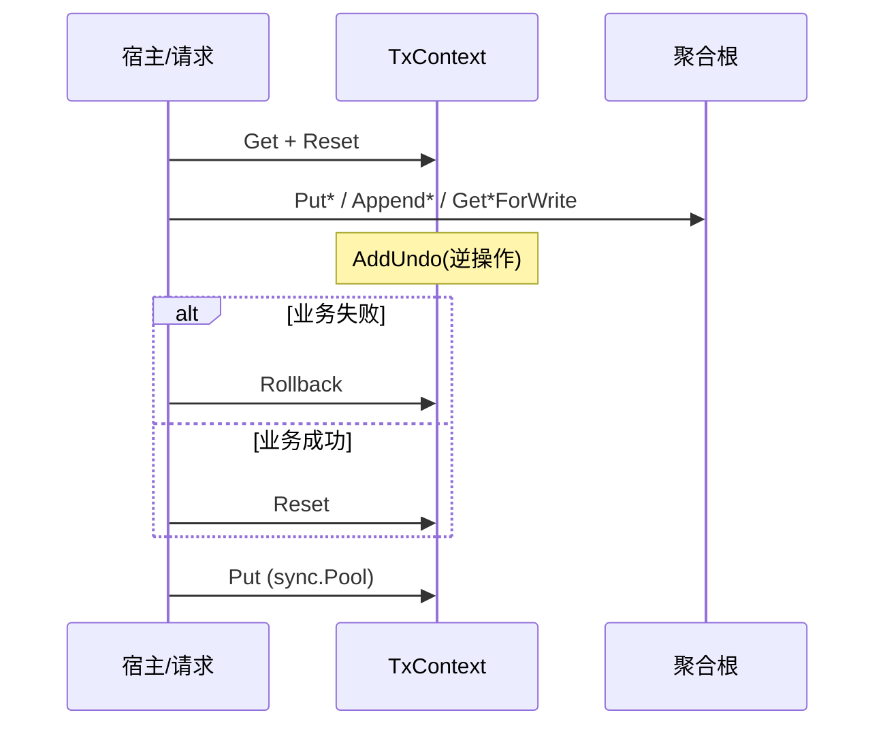

# 架构概览

## Undo Log 原理

cow 在**单协程串行**前提下，对聚合根的每次写通过生成代理注册 **逆操作闭包** 到 `TxContext`：

- **失败**：`Rollback()` 倒序执行闭包，恢复现场；不拷贝整棵聚合根。
- **成功**：`Reset()` 仅清空日志切片，变更保留在聚合根上。

## 与 DeepCopy 对比

运行路径**不**做「每请求整对象 DeepCopy」。仓库内 [k8s deepcopy-gen](https://github.com/kubernetes/code-generator) 生成代码仅作 **benchmark 对照基线**。

### Lite 夹具（`newBenchPlayer`，~100 assets / ~500 items）

摘自 [cow-undo-log-mvp-benchmark.md](../superpowers/benchmarks/cow-undo-log-mvp-benchmark.md)：

| Benchmark | ns/op | allocs/op |
|-----------|------:|----------:|
| `BenchmarkUndoLog_SparseWrite_Rollback` | **114** | **5** |
| `BenchmarkUndoLog_SparseWrite_Commit` | 1,176 | 6 |
| `BenchmarkDeepCopyGen_SparseWrite`（基线） | 9,961 | 508 |

Rollback 路径相对全量 DeepCopy 稀疏写约 **87×** 更快、**~102×** 更少分配（同文档 `benchstat` 结论）。

### Mega 夹具（~1MiB 级 `Player`）

见 [cow-mega-player-benchmark.md](../superpowers/benchmarks/cow-mega-player-benchmark.md)；大对象下 Undo 相对 DeepCopy 优势更明显。

## 工具链角色（简表）

| 工具 | 集成方何时关心 |
|------|----------------|
| `undoproxy-gen` | 首次接入、改模型后重新 `go generate` |
| `undocheck` | CI / 本地 `go vet`，禁止新裸写 |
| `undorewrite` | 一次性迁移历史裸写 |

维护细节见 [toolchain/README.md](../toolchain/README.md)。

## 相关链接

- [tx-context.md](tx-context.md)
- [codegen-undoproxy.md](codegen-undoproxy.md)
- [limitations.md](limitations.md)
