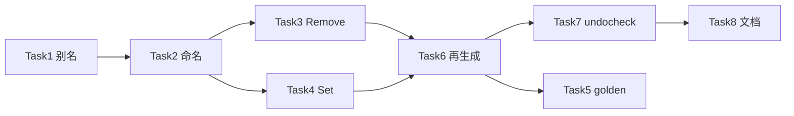

# undoproxy 扩展写 API 实现计划

> **状态：已实现**（2026-05-27）

> **For agentic workers:** REQUIRED SUB-SKILL: Use superpowers:subagent-driven-development (recommended) or superpowers:executing-plans to implement this plan task-by-task. Steps use checkbox (`- [ ]`) syntax for tracking.

**Goal:** 为 `undoproxy-gen` 实现指针 `Set{Field}`、map `Remove{Field}`（不与 Put 混用）、map/slice 类型别名分类；同步 `undocheck`、再生成根包 `zz_generated.undo_proxy.go` 并更新用户文档。

**Architecture:** `peelNamedContainers` + `FieldPlan.DeclaredType` 扩展类型图 → `emitStructuredPtrSet` / `emitStructuredMapRemove` 注册新 `undoKind` → 根包与 testdata 集成测试 → `undocheck` 拦截 `delete(map)`。

**Tech Stack:** Go 1.25、`go/types`、`go/packages`、`internal/cowgen`、`cmd/undoproxy-gen`、`cmd/undocheck`

**Spec:** [../specs/2026-05-27-undoproxy-extended-write-api-design.md](../specs/2026-05-27-undoproxy-extended-write-api-design.md)

---

## 文件结构（目标态）

| 文件 | 职责 | 行数预算 |
|------|------|----------|
| `internal/cowgen/classify.go` | `peelNamedContainers`、写入 `DeclaredType` | ≤500 |
| `internal/cowgen/kind.go` | `FieldPlan.DeclaredType` 字段 | 小改 |
| `internal/cowgen/naming.go` | `PtrSetName`、`MapRemoveName` | ≤80 |
| `internal/cowgen/classify_test.go` | 别名 `BuildGraph` 测试 | ≤120 |
| `cmd/undoproxy-gen/emit_structured.go` | PtrSet + MapRemove 生成 | ≤500（超出拆 `emit_structured_ptr.go` / `emit_structured_map.go`） |
| `cmd/undoproxy-gen/emit_helpers.go` | `mapTypeString` 用 `DeclaredType` | ≤100 |
| `internal/cowproxy/catalog.go` | `FieldMethods.Set`、`Remove` | 小改 |
| `cmd/undoproxy-gen/testdata/types.go` | `EquipBack` + 别名 | 扩展 |
| `cmd/undoproxy-gen/generate_golden_test.go` | 断言 `Set`/`Remove`/别名方法 | 扩展 |
| `undoproxy_ptr_set_test.go` / `undoproxy_map_remove_test.go` | 根包 Rollback 测试 | 新建 |
| `cmd/undocheck/inspect.go`（或新文件） | `delete` 检测 | 小改 |
| `zz_generated.undo_proxy.go` | 再生成 | 提交 |
| `docs/guide/proxy-api.md` | 用户 API 说明 | 更新 |

---

## Task 1: 类型别名分类（`DeclaredType`）

**Files:**
- Modify: `internal/cowgen/kind.go`
- Modify: `internal/cowgen/classify.go`
- Create: `internal/cowgen/classify_test.go`
- Modify: `cmd/undoproxy-gen/testdata/types.go`

- [ ] **Step 1: 写失败测试 `TestBuildGraph_mapSliceTypeAlias`**

```go
func TestBuildGraph_mapSliceTypeAlias(t *testing.T) {
	pkg, err := cowmon.LoadPackage("github.com/huangyuCN/cow/cmd/undoproxy-gen/testdata")
	// ...
	// EquipBack.Equips → KindMapPtrStruct, DeclaredType "Equips"
	// EquipBack.Spares → KindSlicePtr, DeclaredType "ItemList"
}
```

- [ ] **Step 2: 运行失败测试**

```bash
cd /Users/yuchen/mfhl/cow
go test ./internal/cowgen/ -run TestBuildGraph_mapSliceTypeAlias -count=1
# 期望 FAIL
```

- [ ] **Step 3: 扩展 testdata**

在 `cmd/undoproxy-gen/testdata/types.go` 增加：

```go
type Equips map[int64]*Equip
type ItemList []*Item
type Equip struct { Slot int32 }
type EquipBack struct {
	Equips Equips
	Spares ItemList
}
// 确保 EquipBack 从某 +cow 根可达（例如在 Player 上增加 EquipBack 字段，或 EquipBack 为独立根）
```

- [ ] **Step 4: 实现 `peelNamedContainers` + `DeclaredType`**

- `classifyField` 记录 `DeclaredType = TypeStr(原始字段类型)`
- peel 后调用现有 `classifyType`

- [ ] **Step 5: 运行测试通过**

```bash
go test ./internal/cowgen/ -run TestBuildGraph_mapSliceTypeAlias -count=1
```

---

## Task 2: 命名与 emit 辅助

**Files:**
- Modify: `internal/cowgen/naming.go`
- Modify: `internal/cowgen/naming_test.go`
- Modify: `cmd/undoproxy-gen/emit_helpers.go`

- [ ] **Step 1: 测试 `PtrSetName` / `MapRemoveName`**

```go
func TestPtrSetName(t *testing.T) {
	if got := cowgen.PtrSetName("MainHero"); got != "SetMainHero" {
		t.Fatalf("got %q", got)
	}
}
func TestMapRemoveName(t *testing.T) {
	if got := cowgen.MapRemoveName("Heros"); got != "RemoveHeros" {
		t.Fatalf("got %q", got)
	}
}
```

- [ ] **Step 2: 实现命名函数**

- [ ] **Step 3: `mapTypeFromPlan` / `emitStructuredMapEnsure` 使用 `plan.DeclaredType`（非空时）**

---

## Task 3: `Remove{Field}` 生成

**Files:**
- Modify: `cmd/undoproxy-gen/emit_structured.go`
- Test: `undoproxy_map_remove_test.go`（根包）

- [ ] **Step 1: 写失败测试 `TestRollback_RemoveHeros`**

```go
func TestRollback_RemoveHeros(t *testing.T) {
	p := newTestPlayerWithHeros()
	ctx := NewTxContext()
	k := int32(1)
	before := p.Heros[k]
	p.RemoveHeros(ctx, k)
	if _, ok := p.Heros[k]; ok {
		t.Fatal("key should be deleted")
	}
	ctx.Rollback()
	if p.Heros[k] != before {
		t.Fatal("rollback should restore")
	}
}
```

补充：`RemoveHeros` 对不存在 key / nil map 不 push undo（`len(ctx.ops)` 不变）。

- [ ] **Step 2: 实现 `emitStructuredMapRemove`**

覆盖 Kind：
- `KindMapScalar`
- `KindMapStruct`
- `KindMapPtrStruct`
- `KindMapMapScalar` / `KindMapMapStruct` / `KindMapMapPtrStruct`（内层 key）

`undoKind` 后缀：`MapKeyRemove`；Rollback 与 `MapKeySet` 对称。

- [ ] **Step 3: 在 `emitStructuredMethods` 各 map 分支调用 MapRemove**

- [ ] **Step 4: `go generate` testdata 或根包后跑测试**

```bash
go generate ./...
go test . -run TestRollback_Remove -count=1
```

---

## Task 4: `Set{Field}` 生成

**Files:**
- Modify: `cmd/undoproxy-gen/emit_structured.go`
- Test: `undoproxy_ptr_set_test.go`

- [ ] **Step 1: 写失败测试 `TestRollback_SetMainHero`**

```go
func TestRollback_SetMainHero(t *testing.T) {
	p := &Player{MainHero: &Hero{Level: 1}}
	ctx := NewTxContext()
	old := p.MainHero
	p.SetMainHero(ctx, &Hero{Level: 99})
	if p.MainHero.Level != 99 {
		t.Fatal("set failed")
	}
	ctx.Rollback()
	if p.MainHero != old {
		t.Fatal("rollback ptr")
	}
}
```

补充：`SetMainHero(ctx, nil)` 清空且可 Rollback。

- [ ] **Step 2: 实现 `emitStructuredPtrSet`**

- `undoKind` 后缀：`PtrSet`
- 非 nil：`CloneForWrite`

- [ ] **Step 3: `KindPtrStruct` 分支调用 PtrSet**

- [ ] **Step 4: 测试通过**

```bash
go test . -run TestRollback_SetMainHero -count=1
```

---

## Task 5: 改写目录与 golden

**Files:**
- Modify: `internal/cowproxy/catalog.go`
- Modify: `cmd/undoproxy-gen/generate_golden_test.go`

- [ ] **Step 1: `methodsFromPlan` 填充 `Set` / `Remove`**

- [ ] **Step 2: 扩展 golden 断言**

```go
for _, good := range []string{
	"SetMainHero",
	"RemoveHeros",
	"RemoveAssets",
	"PutEquips",
	"RemoveEquips",
} { ... }
```

- [ ] **Step 3: 运行 golden**

```bash
go test ./cmd/undoproxy-gen/ -run TestGenerate -count=1
```

---

## Task 6: 根包再生成

**Files:**
- Regenerate: `zz_generated.undo_proxy.go`
- Modify: `player_test.go`（可选：用新 API 替换临时裸写夹具）

- [ ] **Step 1: 确认 `types.go` 无需改字段（已有 `MainHero`/`Heros`）**

- [ ] **Step 2: 再生成**

```bash
go generate ./...
```

- [ ] **Step 3: 全量测试**

```bash
go test ./... -count=1
```

---

## Task 7: `undocheck` 拦截 `delete`

**Files:**
- Modify: `cmd/undocheck/inspect.go`（或 `delete.go`）
- Create: `cmd/undocheck/testdata/src/barewrite/bad_delete.go`
- Create: `cmd/undocheck/testdata/src/barewrite/good_remove.go`（调用 `RemoveHeros` 的示例，若夹具可引用生成类型则用 after 模式）

- [ ] **Step 1: 写失败测试**（`go test ./cmd/undocheck/...`）

- [ ] **Step 2: 检测 `ast.DeferStmt` 以外的 `delete(call)`，左值为受监控类型的 map 索引**

- [ ] **Step 3: 诊断文案含建议方法名 `Remove{Field}`**

- [ ] **Step 4: 测试通过**

```bash
go test ./cmd/undocheck/... -count=1
```

---

## Task 8: 用户文档

**Files:**
- Modify: `docs/guide/proxy-api.md`
- Modify: `docs/toolchain/type-graph.md`
- Modify: `cmd/undoproxy-gen/README.md`

- [ ] **Step 1: `proxy-api.md` 增加 § Set / § Remove / § 类型别名**

- [ ] **Step 2: 明确 `PutHeros(ctx,k,nil)` ≠ `RemoveHeros`**

- [ ] **Step 3: type-graph 增加别名 peel 说明**

---

## 总体验收

```bash
cd /Users/yuchen/mfhl/cow
go test ./internal/cowgen/... ./cmd/undoproxy-gen/... ./cmd/undocheck/... -count=1
go test . -count=1
go generate ./...
go test . -count=1
```

**不纳入本计划 PR：**

- `undorewrite` 对 `delete` / `p.MainHero =` 的改写
- `docs/superpowers/benchmarks/` 归档（除非 mega 基线显著变化且用户要求）

**提交前：** 向用户展示 `zz_generated.undo_proxy.go` diff 摘要；未经明确同意不 `git commit` / `git push`（见 AGENTS.md）。

---

## 实现顺序（依赖）



Task 3 与 Task 4 可并行；Task 1 必须先完成。
