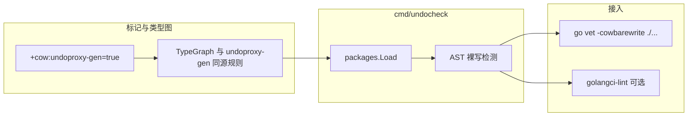

# 裸写防护（Bare Write Guard）设计说明

| 项 | 值 |
|---|---|
| 状态 | 已实现（2026-05-25） |
| 模块 | `github.com/huangyuCN/cow` |
| 需求来源 | 业务可能绕过 `undoproxy-gen` 代理直接改字段；初始化路径亦需界定 |
| 前置 | `undoproxy-gen`、`zz_generated.undo_proxy.go`、`TxContext` 已落地 |

## 1. 目标

- 对纳入 **undoproxy 类型图** 的所有 struct（`// +cow:undoproxy-gen=true` 根类型 + 同包嵌套 struct，规则与 `undoproxy-gen` 一致），在业务代码中 **禁止裸写**。
- **保持字段导出**，不破坏现有 `json` / `bson` / `protobuf` 标签与序列化路径。
- **凡引用受监控类型的包均检查**；仅通过文件路径白名单与行级 `//cow:allow-bare-write` 放行。
- CI / 本地：**违规一律 error**（无 warning 阶段）。

## 2. 非目标（本阶段）

- 字段改为非导出（与 JSON/BSON 友好冲突）。
- 运行期检测裸写（仅作未来可选补充）。
- 强制「必须在带 `*TxContext` 参数的函数内」才允许调用代理（本工具只禁裸写，不绑 ctx 作用域）。
- 拦截 `json.Unmarshal` / `bson.Unmarshal` 的反射写入（静态不可见）；约定 Unmarshal 后业务仍不得裸写，或后续 DTO 分层。
- AST 批量改写存量（`save_historey.md` 设想）；另立项，不替代本分析器。

## 3. 方案选择

| 方案 | 结论 |
|---|---|
| **1. `go/analysis` 分析器 `undocheck`** | **采用** |
| 2. 仅 AST codemod | 不采用为主方案（无法杜绝新漏写） |
| 3. 字段非导出 | 不采用（serde 成本高） |

## 4. 架构



- **命令**：`cmd/undocheck`（`go install` 后作为 `go vet` 分析器或独立 `undocheck ./...`）。
- **类型图**：复用/共享 `undoproxy-gen` 的「根标记 + 同包可达 struct」判定，避免生成器与检查器不一致。
- **分析器名**：`cowbarewrite`（对外文档统一此名）。

## 5. 裸写定义（须报 error）

对 **受监控类型** 的左值（含 `*Player`、经 `Get*ForWrite` 返回的 `*Hero`、slice/map 元素解引用后的受监控指针等）：

| 模式 | 示例 |
|------|------|
| 字段赋值 | `p.Level = 1` |
| 复合赋值 | `p.Level += 1`、`m["k"] += 1`（左值为受监控聚合） |
| Inc/Dec | `p.Level++` |
| append 赋回 slice 字段 | `p.Items = append(p.Items, x)` |
| map 下标写 | `p.Assets["gold"] = 100` |
| slice 下标写 | `p.Items[0] = x` |
| 嵌套选择符写 | `p.MainHero.Level = 2` |
| Get*ForWrite 后继续裸写 | `h := p.GetMainHeroForWrite(ctx); h.Level = 2` |

**允许（不报）**

- 只读访问、range、传参（只读）、比较。
- 调用生成代理：`Put*`、`Append*`、`Set*`、`Remove*`、`Truncate*`、`Get*ForWrite` 等（在**非白名单**文件中调用代理是允许的）。
- `DeepCopy`、序列化 API。

**白名单文件内**（见 §6）：允许为实现代理/克隆/夹具而对字段赋值（含 `zz_generated.undo_proxy.go` 内部实现）。

## 6. 白名单

### 6.1 文件级（整文件跳过）

| 模式 | 说明 |
|------|------|
| `zz_generated*.go` | 含 `undo_proxy`、`deepcopy` 生成代码 |
| `*_fixture.go`、`*_fixtures.go` | 夹具与初始化构造 |
| `cmd/undoproxy-gen/**` | 生成器自身 |
| `deepcopy_generate.go`、`undo_proxy_generate.go` | generate 指令 |

**不**默认跳过 `*_test.go`：测试与生产一致，须走代理；测试数据构造放在 `*_fixture.go`。

### 6.2 行级逃逸

- `//cow:allow-bare-write`（上一行或同行注释）。
- 用于极少数存量过渡；code review 要求简短 reason（issue 编号或 TODO）。

### 6.3 检查范围

- **凡 import 并使用受监控类型的包**均参与分析（不仅限「业务包」目录名）。
- 类型定义文件 `types.go`：仅 struct 定义与 tag，无赋值则自然通过；若有赋值应迁至 `*_fixture.go`。

## 7. 与初始化、序列化

| 场景 | 策略 |
|------|------|
| `newBenchPlayer()` 等 | 写在 `*_fixture.go`（白名单） |
| 业务逻辑 | 仅代理 API |
| `json`/`bson` Unmarshal | 分析器不可见；规范：反序列化后禁止裸写；长期可选 DTO→`Build*` |
| Benchmark 热路径裸写 | 迁至 fixture 或改为代理调用 |

## 8. 错误信息

诊断须包含：

- 受监控类型名、字段/操作描述；
- 建议代理方法名（若能从字段推断 `PutLevel` / `AppendItems` 等）；
- 文档链接：`docs/superpowers/specs/2026-05-25-bare-write-guard-design.md`。

示例：

```text
cowbarewrite: 禁止对 *Player 裸写字段 Level，请使用 PutLevel(ctx, …)
```

## 9. 测试与 CI

- `cmd/undocheck/testdata/`：正反例 `.go` 文件 + 期望诊断。
- 本仓库：`go test ./cmd/undocheck/...`；根目录 CI 增加 `go vet -cowbarewrite ./...`（或 `undocheck ./...`）。
- 与 `undoproxy-gen` 变更联动：类型图规则变更时同步更新 undocheck 测试。

## 10. 已确认决策（brainstorming）

| 决策项 | 选择 |
|--------|------|
| 约束方式 | 静态分析（B），字段保持导出 |
| 检查范围 | 凡使用标记类型的包（B） |
| 严重程度 | 一律 error（A） |
| `*_test.go` | **不**白名单，与生产一致 |
| JSON/BSON | 不改为非导出字段 |

## 11. 后续可选（非本 spec）

- AST codemod 批量替换历史裸写（`save_historey.md`）。
- Unmarshal 专用 `BuildPlayerFromDTO`。
- golangci-lint 官方插件仓库分发。
