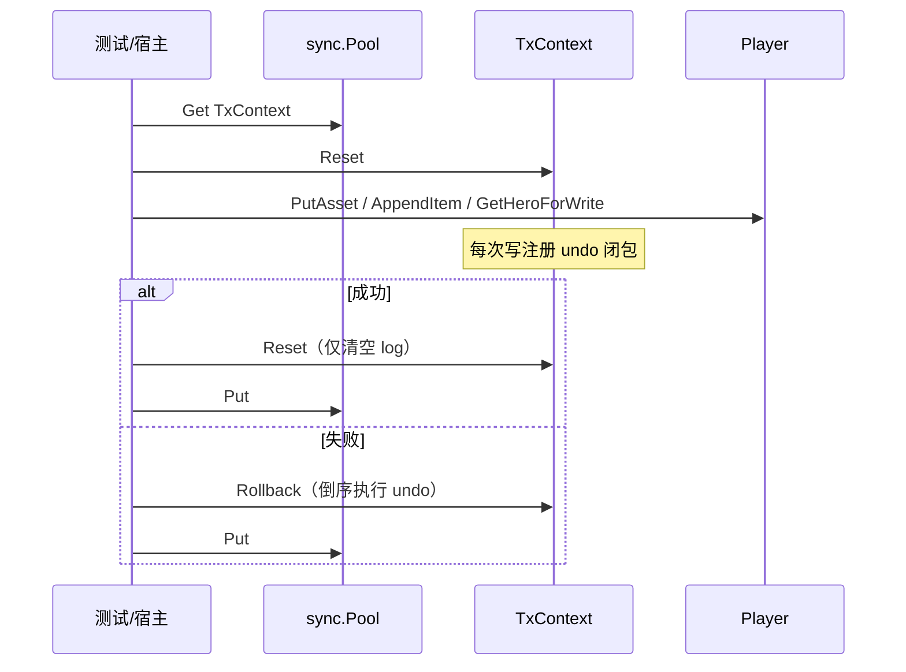

# COW Undo Log MVP 设计说明

| 项 | 值 |
|---|---|
| 状态 | 已批准（brainstorming 2026-05-25） |
| 模块 | `github.com/huangyuCN/cow` |
| 需求来源 | 已并入 [docs/guide/overview.md](../../guide/overview.md)（2026-05-25） |
| 前置 | 不沿用已删除的 `TxSession` / 路径 COW 实现；本次为全新 Undo Log 验证 |

## 1. 目标

在**单协程串行**前提下，验证「操作留痕 + 逆操作回滚（Undo Log）」能否同时满足：

1. **语义**：业务失败时一键回滚，常驻 `Player` 状态与请求前一致；成功时变更保留且无数据拷贝。
2. **性能**：相对「每次请求对整棵 `Player` 做 k8s `deepcopy-gen` 全量深拷贝后在副本上稀疏写」，在 CPU、`allocs/op` 上具备明显优势（中等体量夹具）。

## 2. 非目标（MVP 不做）

- 并发安全、`Mutex`、多 goroutine 共享同一 `TxContext`。
- 代码生成写代理（本期手写三个方法）；Slice `Set` 代理。
- `package main` 演示程序；集成具体宿主（Actor/HTTP）。
- 恢复旧版 Session/COW、路径拷贝、overlay 等方案。

## 3. 方案选择

采用 **方案 1：闭包 Undo 栈**（与 PRD 模板一致）。

| 方案 | 结论 |
|---|---|
| 闭包 Undo 栈 | **采用** |
| 结构化 Undo 记录 | 后续生成器演进时再考虑 |
| 全量 DeepCopy + 局部 COW 混合 | 不采用 |

## 4. 架构



核心原则：**不拷贝业务数据，只记录逆操作**；成功路径零 DeepCopy。

## 5. 包与文件布局

所有实现位于根包 `cow`：

| 文件 | 职责 |
|---|---|
| `doc.go` | 包注释；`+k8s:deepcopy-gen=package` 等 codegen 包级 tag |
| `types.go` | `Item`、`Hero`、`Player`；`Hero.Clone()` 手写 |
| `zz_generated.deepcopy.go` | **提交 Git**；由 `deepcopy-gen` 生成 |
| `deepcopy_generate.go` | `//go:generate` 指令（可与其他文件合并，若行数允许） |
| `tx.go` | `TxContext`、`sync.Pool`、`AddUndo`、`Rollback`、`Reset` |
| `player_proxy.go` | `PutAsset`、`AppendItem`、`GetHeroForWrite` |
| `player_test.go` | 回滚/提交正确性 |
| `bench_fixture_test.go` | `newBenchPlayer()`（~100 assets、~500 items） |
| `benchmark_test.go` | Undo vs DeepCopyGen 对比 |

单文件 ≤500 行、单函数 ≤50 行（`AGENTS.md`）。

## 6. 数据模型

与项目聚合根模型（见根包 `types.go`）一致：

- `Item`、`Hero`、`Player` 保留 protobuf / json / bson tag（不实际序列化）。
- `Hero.Clone()`：单层值拷贝，供 `GetHeroForWrite` 延迟局部拷贝。
- `Player` 含 `map[string]int64`、`[]*Item`、`*Hero`。

### 6.1 deepcopy-gen

- 使用 Kubernetes **deepcopy-gen**（`k8s.io/code-generator/cmd/deepcopy-gen`）为包内类型生成 `DeepCopy`、`DeepCopyInto`、`DeepCopyObject`（视生成规则而定）。
- 包级 tag 示例：`// +k8s:deepcopy-gen=package`，`// +groupName=cow.huanghaiyu.cn`（实现时可微调 groupName，保持单一值）。
- **生成文件提交进 Git**：克隆后可直接 `go test`，CI 默认不跑 generate。
- 修改 `types.go` 或 tag 后：本地执行 `go generate ./...`，将更新的 `zz_generated.deepcopy.go` 一并提交。
- 运行时依赖：`k8s.io/apimachinery/pkg/runtime`（生成代码引用）；`go.mod` 中固定 `code-generator` / `apimachinery` 版本。

### 6.2 对照基线（Benchmark）

每次迭代表示「一次请求」：

```text
work := in.DeepCopy()   // 或 DeepCopyInto，以生成 API 为准
// 在 work 上直接修改：Assets["gold"]、Items append、Hero.Level
// 丢弃 work，不提交 undo
```

必须为**整图**深拷贝（含全部 map 键值、slice 元素、Hero 子树），不得使用共享容器的浅拷贝基线。

## 7. TxContext

```go
type TxContext struct {
    undoLogs []func()
}
```

| 方法 | 行为 |
|---|---|
| `AddUndo(fn)` | `append` 到 `undoLogs` |
| `Rollback()` | `i` 从 `len-1` 到 `0` 执行 `undoLogs[i]` |
| `Reset()` | `undoLogs = undoLogs[:0]`，复用底层数组 |

- `sync.Pool`：`New` 返回 `undoLogs` 容量 16 的 `*TxContext`。
- **无 Mutex**（单协程前提）。
- 误用约定：同一 scope 内 `Rollback` 后不再 `AddUndo`；MVP 不封装 Session 类型，由调用方保证。

## 8. 写代理 API

| 方法 | 记录 | Undo |
|---|---|---|
| `PutAsset(ctx, key, val)` | key 存在 → 旧值；不存在 → 标记删除 | 写回旧值或 `delete(Assets, key)` |
| `AppendItem(ctx, item)` | `oldLen := len(Items)` | `Items = Items[:oldLen]` |
| `GetHeroForWrite(ctx)` | `old := Hero`；`Hero = old.Clone()` | `Hero = old` |

- 所有写作用于**常驻** `Player` 指针。
- `GetHeroForWrite`：测试夹具保证 `Hero != nil`；nil 行为不在 MVP 范围定义。

## 9. 测试

### 9.1 正确性（`player_test.go`）

| 测试 | 场景 |
|---|---|
| `TestRollback_RestoresInitialState` | 中等 `Player` → 三次稀疏写 → 返回 error → `Rollback` → 与初始快照相等（uid、assets、items 长度与内容、hero 字段） |
| `TestCommit_KeepsMutations` | 同写路径无 error → 仅 `Reset` → 断言 gold/items/hero 已变更 |

断言优先 `cmp.Equal`（`google/go-cmp`）或字段级比较；需比较 slice/map 内容。

### 9.2 Benchmark 夹具（B 档）

`newBenchPlayer()`：

- `Assets`：约 **100** 个键（含 `gold`、`diamond` 等）。
- `Items`：约 **500** 个 `*Item`。
- `Hero`：非 nil，固定 `HeroId` / `Level`。

每轮稀疏写（与正确性测试一致）：

1. `PutAsset(ctx, "gold", newVal)`
2. `AppendItem(ctx, newItem)`
3. `GetHeroForWrite(ctx)` → 改 `Level`

### 9.3 Benchmark 用例

| 名称 | 含义 |
|---|---|
| `BenchmarkUndoLog_SparseWrite_Commit` | Pool Get → Reset → 3 代理写 → Reset → Put |
| `BenchmarkUndoLog_SparseWrite_Rollback` | 同上，末步 `Rollback` |
| `BenchmarkDeepCopyGen_SparseWrite` | `DeepCopy` + 在副本上 3 处直接写（无 undo） |

实现后执行：

```bash
go test -bench=. -benchmem ./...
```

按 `AGENTS.md` 用 `benchstat` 对比、表格汇报，并询问是否归档到 `docs/superpowers/benchmarks/`。

## 10. 开发顺序（TDD）

1. 添加 `types.go` + deepcopy tag + `go generate` + 提交 `zz_generated.deepcopy.go`。
2. 写失败测试：`TestRollback_*`、`TestCommit_*`（代理尚未实现时 RED）。
3. 实现 `tx.go`、`player_proxy.go` 至 GREEN。
4. 写 `bench_fixture_test.go`、`benchmark_test.go`；跑 benchmark 并记录对比。
5. 重构：提取重复 undo 模式（若有），保持文件/函数行数限制。

## 11. 与 PRD 差异（ intentional ）

| PRD | 本设计 |
|---|---|
| `package main` + `main()` | 仅 `*_test.go` |
| 手写 DeepCopy 基线 | `deepcopy-gen` 生成并**提交** |
| 示例小对象 | B 档 ~100 / ~500 |
| Slice `Set` | MVP 省略 |

## 12. 验收标准

- [ ] `go test ./...` 全部通过（含正确性测试）。
- [ ] 回滚后 `Player` 与初始状态一致；提交后变更保留。
- [ ] 三组 Benchmark 可运行；Undo Commit 路径 `allocs/op` 显著低于 DeepCopyGen（中等夹具、稀疏写）。
- [ ] `zz_generated.deepcopy.go` 已提交且与 `types.go` 一致。
- [ ] 代码注释为中文；符合 `AGENTS.md` 行数约束。

## 13. 后续（非 MVP）

- 写代理代码生成（类似 k8s Deepcopy 心智模型）。
- 结构化 Undo、Savepoint、更大夹具 benchmark 归档。
- 正式 Session API 封装（`Begin`/`Commit`/`Rollback`）若验证通过再设计。
