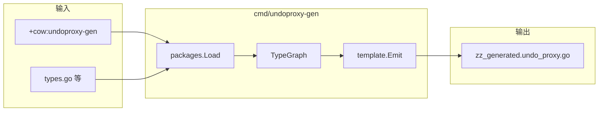

# Undo 写代理代码生成器（undoproxy-gen）设计说明

| 项 | 值 |
|---|---|
| 状态 | 已批准（brainstorming 2026-05-25；增补 Slice Remove/Truncate、map 值为嵌套 map/slice） |
| 模块 | `github.com/huangyuCN/cow` |
| 需求来源 | `new.md` §3–§4；`MVP_REQUIREMENTS.md` §3.3（由手写演进为生成） |
| 前置 | `TxContext` / `Rollback` / `Reset` 已在 `tx.go` 实现；`deepcopy-gen` 用于 Benchmark 基线 |

## 1. 目标

提供独立命令 **`undoproxy-gen`**，对任意带复杂嵌套 **Map / Slice / Pointer / struct** 的 Go 结构体定义，自动生成符合 `new.md` §3–§4 的：

- `Put{Field}`（标量、各级 map 写入）
- `Append` / `Set` / `Remove` / `Truncate`（**字段级 slice**，以及 **`map[K][]T` 按 key**）
- `Get*ForWrite`（指针字段、`map[K]*Struct`、`map[K]map[K2]*Struct` 等）
- `Get{Field}MapForWrite`（**`map[K]map[K2]V` 内层 map** 的延迟浅拷贝）
- `CloneForWrite()`（每层 struct 浅拷贝）

生成方法挂在**原业务类型**上，输出 `zz_generated.undo_proxy.go`，与手写 `player_proxy.go` 语义一致并支持任意深度嵌套。

## 2. 非目标（本阶段不做）

- 并发安全、`TxContext` 池化策略变更（沿用现有 `tx.go`）。
- `protoc` 插件形态（仅面向 Go 源码 + `go/packages`）。
- 跨包嵌套 struct 字段（初版仅**同包**可达类型；见 §7）。
- `interface{}`、channel、func 作为 map 值或 slice 元素类型。
- 按业务字段展开的便捷 API（如 `PutSkill(ctx, id, level)` 仅两个 int）；统一为 `PutSkills(ctx, key, val *Skill)`。
- 运行期 `reflect` 动态代理。

## 3. 方案选择

| 方案 | 结论 |
|---|---|
| **1. `go/packages` + `go/types` + `text/template`** | **采用**（与 k8s codegen 同族，类型信息完整） |
| 2. 仅 `go/parser` + AST 字符串 | 不采用（别名/嵌入/泛型易错） |
| 3. 运行期 reflect | 不采用（无法产出静态 `Put*` 方法） |

## 4. 已确认的生成策略（brainstorming 2026-05-25）

| 决策项 | 选择 |
|---|---|
| 生成范围 | `// +cow:undoproxy-gen=true` 根类型 + **同包可达**嵌套 struct |
| Slice | **Append + Set + RemoveAt + Truncate**（所有元素类型） |
| 克隆 | 生成器为每个纳入图的 struct 生成 **`CloneForWrite()`** |
| Map | **`Get*ForWrite` + `Put*`**；支持 **`map[K][]T`、`map[K]map[K2]V`** 等嵌套值类型（见 §7.1） |
| 接入 | **`cmd/undoproxy-gen`** + `go install` + `//go:generate` → `zz_generated.undo_proxy.go` |

## 5. 架构



- **不生成** `TxContext`（已存在于 `tx.go`）。
- 生成器落地后，删除手写 `player_proxy.go`，测试改为调用生成方法。

## 6. 标记与 `go:generate`

**包级**（`doc.go`）：

```go
// +cow:undoproxy-gen=package
// +groupName=cow.huanghaiyu.cn
```

**聚合根**（`types.go`）：

```go
// +cow:undoproxy-gen=true
type Player struct { ... }
```

**生成指令**（`undo_proxy_generate.go`）：

```go
//go:generate undoproxy-gen --output-file zz_generated.undo_proxy.go github.com/huangyuCN/cow
```

**安装**：

```bash
go install ./cmd/undoproxy-gen
```

## 7. 类型图（TypeGraph）

从每个带 `+cow:undoproxy-gen=true` 的 struct 做 BFS，收集**同包**内可达 struct。

**字段分类**（驱动模板）：

| 分类 | 条件 | 生成 API |
|---|---|---|
| Scalar | `bool`、整数、浮点、`string` | `Put{Field}(ctx, v)` |
| PtrStruct | `*Struct`（同包 struct） | `Get{Field}ForWrite(ctx) *Struct` |
| MapScalar | `map[K]V`，V 为标量 | `Put{Field}(ctx, key, val)` |
| MapPtrStruct | `map[K]*Struct` | `Get{Singular}ForWrite(ctx, key) *Struct`<br>`Put{Field}(ctx, key, val *Struct)` |
| MapStruct | `map[K]Struct` | `Put{Field}(ctx, key, val Struct)` |
| SliceValue | `[]T`，T 非指针 | `Append{Field}`、`Set{Field}At`、`Remove{Field}At`、`Truncate{Field}` |
| SlicePtr | `[]*T` | 同上，元素类型为 `*T` |

### 7.1 嵌套容器（map 值 / 递归展开）

TypeGraph 对字段类型**递归脱壳**（`map` / `slice` / 指针），在**同包**内展开；为每一层容器生成带**多级 key 参数**的代理（挂在**拥有该字段的 struct** 上）。

| 分类 | 条件 | 生成 API（示例字段 `Loot map[int32][]*Item`） |
|---|---|---|
| MapSliceValue | `map[K][]T`，T 为标量/同包 struct 值 | `PutLoot(ctx,k,val []T)`；`AppendLootAt` / `SetLootAt` / `RemoveLootAt` / `TruncateLoot`（均含 `k`） |
| MapSlicePtr | `map[K][]*Struct` | 同上 + `GetItemAtForWrite(ctx,k,i)*Struct`（元素 COW） |
| MapMapScalar | `map[K]map[K2]V`，V 标量 | `PutLoot(ctx,k,k2,v)`；`GetLootMapForWrite(ctx,k) map[K2]V`（内层 map 浅克隆） |
| MapMapPtrStruct | `map[K]map[K2]*Struct` | `PutLoot`；`Get{Singular}ForWrite(ctx,k,k2)`；`GetLootMapForWrite(ctx,k)` |
| MapMapStruct | `map[K]map[K2]Struct` | `PutLoot(ctx,k,k2,val Struct)`；`GetLootMapForWrite` |
| MapMapSlice* | `map[K]map[K2][]T` 等更深嵌套 | 在 §7.1 规则上**继续叠加** key 参数与方法后缀（见 §8.1） |

**深度**：不人为限制 `map→map→slice` 层数；仅受 Go 类型与同包 struct 可达性约束。生成文件内可为每种 `map[K]V` 生成私有 **`clone{X}MapShallow`** 辅助函数（仅拷贝 map 桶，标量值全拷贝，`*Struct` 拷贝指针）。

**初版 fail fast（退出码 1）**：

- map / slice 元素为 `interface{}`、func、channel
- slice 元素为 channel、func
- 字段引用**其他包**的 struct（未在 `--allow-external` 中显式放开时）
- 根类型缺少 `+cow:undoproxy-gen=true`
- `K` 不可比较（非 map key 合法类型）

## 8. 命名规则

- 方法挂在类型 `T` 上：`(t *T) Method(ctx *TxContext, ...)`
- 标量 / 单层 map：`Put{Field}`；**字段级** slice：`Append{Field}`、`Set{Field}At`、`Remove{Field}At`、`Truncate{Field}`
- `map[K]*Struct` 的 Get：`Get{Singular}ForWrite(ctx, k)`
- **嵌套 map / map+slice**：方法名保留**最外层字段名** `{Field}`，后续 key 依次为参数（§8.1）
- 首参恒为 `ctx *TxContext`

### 8.1 嵌套命名字段表（`Loot map[int32][]*Item`）

| 操作 | 方法名模式 |
|---|---|
| 替换 `m[k]` 整条 slice | `Put{Field}(ctx, k, val []T)` |
| 向 `m[k]` 追加 | `Append{Field}At(ctx, k, elem)` |
| 改 `m[k][i]` | `Set{Field}At(ctx, k, i, elem)` |
| 删 `m[k][i]` | `Remove{Field}At(ctx, k, i)` |
| 截断 `m[k]` | `Truncate{Field}(ctx, k, n)` |
| COW `m[k][i]` 为 `*Struct` | `Get{ElemSingular}AtForWrite(ctx, k, i)` |
| 内层 map COW | `Get{Field}MapForWrite(ctx, k)` → 可写 `map[K2]V` |
| 内层 `map[k2]` 标量 / struct / `*Struct` | `Put{Field}(ctx, k, k2, …)` / `Get{Singular}ForWrite(ctx, k, k2)` |

`Singular` / `ElemSingular`：由字段名与元素类型名推导（`Heros`→`Hero`，`Items` 元素 `*Item`→`Item`）。

## 9. 生成语义（与 `new.md` 对齐）

### 9.1 标量 `Put{Field}`

```go
old := t.Field
ctx.AddUndo(func() { t.Field = old })
t.Field = newVal
```

### 9.2 Map 标量 / struct 值 `Put{Field}`

与现有 `PutAsset` 一致：`nil` map 初始化并 Undo 为 `nil`；key 存在则恢复旧值，不存在则 `delete(m, key)`。

### 9.3 `map[K]*Struct` — `Get{Singular}ForWrite`

```go
old, ok := m[k]
if !ok || old == nil { return nil }
dirty := old.CloneForWrite()
ctx.AddUndo(func() { m[k] = old })
m[k] = dirty
return dirty
```

### 9.4 `map[K]*Struct` — `Put{Field}`

- 同 9.2 的 Undo 分支
- 写入：`m[k] = cloneIncomingPtr(val)`（对非 nil `val` 调用 `CloneForWrite()`，避免污染只读子图）

### 9.5 `map[K]Struct` — `Put{Field}`

Undo 恢复旧 struct 值或 `delete`；赋值 `m[k] = val`（值拷贝）。

### 9.6 Slice `Append{Field}`

```go
oldLen := len(s)
s = append(s, elem)
ctx.AddUndo(func() { s = s[:oldLen] })
```

### 9.7 Slice `Set{Field}At`

```go
old := s[i]
ctx.AddUndo(func() { s[i] = old })
s[i] = newElem
```

- `[]*T`：Set 仅替换槽位指针；若需改指针指向对象内部，须先对元素走 `Get*ForWrite` 或 map 代理。
- **不生成** bounds check（与手写 MVP 一致）。

### 9.8 Slice `Remove{Field}At`

按索引删除单个元素（`append(s[:i], s[i+1:]...)`），与 Map 的 `delete` 对称。

```go
old := s[i]
s = append(s[:i], s[i+1:]...)
ctx.AddUndo(func() {
	s = append(s[:i], append([]T{old}, s[i:]...)...)
})
```

- `[]*T`：`old` 为 `*T`，Undo 恢复被删槽位的**原指针**（不 Clone）。
- Undo 会分配一小段 slice header/底层（拼回删除元素），为可回滚删除的代价；**Append 的 Undo 仍为零分配**。

### 9.9 Slice `Truncate{Field}`

将长度截断为 `n`（`s = s[:n]`，且 `n < len(s)` 时生效）。

```go
oldLen := len(s)
if n >= oldLen {
	return // 无变更，不注册 Undo
}
tail := append([]T(nil), s[n:]...) // 拷贝被截掉尾部，供回滚
s = s[:n]
ctx.AddUndo(func() { s = append(s, tail...) })
```

- `[]*T`：`tail` 类型为 `[]*T`，语义同上。
- 与 **Append** 互补：Append 用 `oldLen` 截断回滚；Truncate 保存被截尾部再 `append` 回去。
- `n >= len(s)`：**无操作**，不压栈 Undo（避免空 Undo）。

### 9.10 字段 `*Struct` — `Get{Field}ForWrite`

```go
old := t.Field
if old == nil { return nil }
dirty := old.CloneForWrite()
ctx.AddUndo(func() { t.Field = old })
t.Field = dirty
return dirty
```

### 9.11 公共：`ensure` 与 `map[k]` 上的 slice

凡读写 **`m[k]`**（`m` 为 `map[K][]T` 或 `map[K][]*T`），生成器内联同一套前置逻辑：

1. **`m == nil`**：`AddUndo` 恢复 `nil` → `m = make(map[K]…)`
2. **读取** `prev, existed := m[k]`，`oldLen := len(prev)`
3. **写回** 必须 `m[k] = …`（不可只改局部变量 `prev`，避免未写回 map）
4. **Undo**：`existed == false` → `delete(m, k)`；否则 `m[k] = prev[:oldLen]`（Append/Truncate）或恢复 `prev` 整段引用（Put 整条 slice）

`Append{Field}At(ctx, k, elem)` 示例：

```go
// ensure 外层 map …
prev, existed := m[k]
oldLen := len(prev)
m[k] = append(prev, elem)
ctx.AddUndo(func() {
	if !existed {
		delete(m, k)
	} else {
		m[k] = prev[:oldLen]
	}
})
```

`Set` / `Remove` / `Truncate` 在 `m[k]` 上复用 §9.7–9.9 逻辑，仅增加参数 `k` 与 ensure。

### 9.12 `map[K][]T` — `Put{Field}(ctx, k, val []T)`

- 外层 map 的 ensure 同 §9.2
- `old, existed := m[k]`；`m[k] = val`（`val` 为 `nil` 时等同清空该 key 的 slice 引用）
- Undo：`existed` → `m[k]=old`；否则 `delete(m, k)`

### 9.13 `map[K][]*Struct` — `Get{Elem}AtForWrite(ctx, k, i)`

在 **`m[k][i]`** 上做与 §9.3 相同的指针 COW：`old := m[k][i]` → `CloneForWrite` → Undo 挂回 `m[k][i]`。若 `m` 或 `m[k]` 不存在 / `i` 越界：与字段级 slice 相同，**不生成** bounds check。

### 9.14 `map[K]map[K2]V` — `Get{Field}MapForWrite(ctx, k)`

对**外层 key** 的**内层 map** 做延迟浅拷贝（只拷贝 map 结构，不 DeepCopy 值）：

```go
// ensure 外层 map
oldInner, existed := m[k]
if !existed || oldInner == nil {
	newInner := make(map[K2]V) // 或按需 nil 语义
	ctx.AddUndo(func() {
		if !existed {
			delete(m, k)
		} else {
			m[k] = oldInner
		}
	})
	m[k] = newInner
	return newInner
}
dirty := clone{Field}MapShallow(oldInner)
ctx.AddUndo(func() { m[k] = oldInner })
m[k] = dirty
return dirty
```

- 内层值为 `*Struct` 时，浅克隆 map **不** 调用各 value 的 `CloneForWrite`；修改具体 value 仍走 `Get{Singular}ForWrite(ctx, k, k2)`。
- 内层值为标量 / struct 值：通过 `Put{Field}(ctx, k, k2, val)` 写入，Undo 同 §9.2（内层 key 不存在则 `delete(inner, k2)`）。

### 9.15 `map[K]map[K2]*Struct` — `Get{Singular}ForWrite(ctx, k, k2)`

与 §9.3 相同，但定位 `inner := m[k]`（若内层 map 未 COW，须先 `Get{Field}MapForWrite(ctx,k)` 或由本方法内联 ensure 内层存在）。推荐生成器：**Get 不自动 COW 整段内层 map**，仅 COW `inner[k2]` 指针槽位（与 `Player.Heros[id]` 单指针一致）。

### 9.16 更深嵌套（`map[K]map[K2][]T` 等）

按 §7.1 **递归**生成：参数列表按外层→内层 key 顺序展开；slice 操作在最内层 slice 上套用 §9.11 + §9.7–9.9。示例 `Buffs map[int32]map[string][]int32`：

- `AppendBuffsAt(ctx, playerId, statKey, v int32)`
- `PutBuffs(ctx, playerId, statKey, vals []int32)`

### 9.17 `CloneForWrite()`

对每个纳入图的 struct：

- 值字段：逐字段拷贝
- `map` / `slice` / 指针字段：**保留原引用**（浅拷贝一层）
- `nil` 接收者返回 `nil`

## 10. `cmd/undoproxy-gen` 布局

| 文件 | 职责 |
|---|---|
| `main.go` | CLI：`--output-file`、包 import 路径 |
| `loader.go` | `packages.Load`、解析 tag |
| `graph.go` | 类型图、字段分类 |
| `naming.go` | 方法名、Singular |
| `emit.go` | 模板渲染、写文件 |
| `templates/` 或 `//go:embed` | `text/template` |

约束：`AGENTS.md` 单文件 ≤500 行、单函数 ≤50 行。

输出头：

```go
// Code generated by undoproxy-gen. DO NOT EDIT.
```

## 11. 与现有仓库的集成步骤（概要）

1. 在 `doc.go` / `Player` 增加 `+cow:undoproxy-gen` tag。
2. 实现 `cmd/undoproxy-gen` 至可生成 `zz_generated.undo_proxy.go`。
3. 扩展 `types.go` fixture（可选 `Hero`/`Skill` 嵌套 map，对齐 `new.md` 示例）。
4. 删除 `player_proxy.go`；更新 `player_test.go` 调用生成 API。
5. `go generate ./...` 后提交 `zz_generated.undo_proxy.go`。
6. Benchmark 仍用 `deepcopy-gen` 基线，代理路径走生成方法。

## 12. 测试策略

| 层级 | 内容 |
|---|---|
| 单元测试 | `naming`、`graph` 对小 fixture 断言分类与方法名 |
| 黄金测试 | `testdata/types.go` → 对比 `testdata/zz_generated.golden.go` |
| 集成 | 根包 `go test`：slice 删截断；`map[k][]T` / `map[k]map[k2]v` 回滚；深层 `Heros→Skills` |

## 13. 验收标准

- [ ] `go install ./cmd/undoproxy-gen` 成功
- [ ] `go generate ./...` 生成 `zz_generated.undo_proxy.go` 且无编译错误
- [ ] `Player` 上 `Put*` / `Append*` / `Set*At` / `Remove*At` / `Truncate*` / `Get*ForWrite` 与 MVP 手写行为一致（含 Undo/Rollback）
- [ ] Slice 删除：`RemoveItemsAt` 回滚后元素与顺序恢复；`TruncateItems` 回滚后长度与尾部元素恢复
- [ ] 嵌套 `map[K]*Struct` 至少两层（`Player.Heros` → `Hero.Skills`）
- [ ] `map[K][]T`：`Append*At`/`Remove*At` 回滚后 `m[k]` 长度与元素正确；`Put` 整条 slice 可恢复
- [ ] `map[K]map[K2]V`：`Get*MapForWrite` + 内层 `Put` 回滚后外层 key 与内层快照一致
- [ ] 生成器对 §7 非法类型明确报错退出

## 14. 参考

- `new.md` — HLD §3 状态机、§4 模板
- `docs/superpowers/specs/2026-05-25-cow-undo-log-mvp-design.md` — Undo Log MVP（手写阶段）
- `player_proxy.go` — 现行手写代理参考实现
