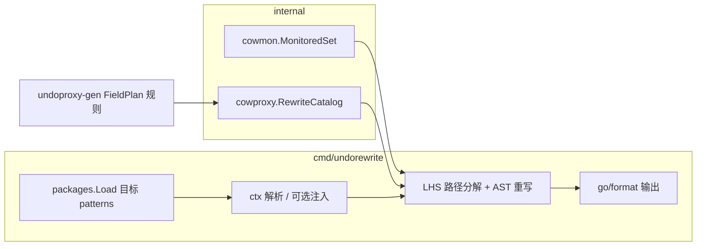

# 历史裸写静态改写（undorewrite）设计说明

| 项 | 值 |
|---|---|
| 状态 | 已实现（2026-05-25） |
| 模块 | `github.com/huangyuCN/cow` |
| 需求来源 | 已并入 [docs/guide/migration-undorewrite.md](../../guide/migration-undorewrite.md)；与 `undocheck`（`cowbarewrite`）互补 |
| 前置 | `undoproxy-gen`、`zz_generated.undo_proxy.go`、`internal/cowmon`、`cmd/undocheck` |
| 扩展 | 独立 module 接入见 [2026-05-27-undorewrite-consumer-alignment-design.md](2026-05-27-undorewrite-consumer-alignment-design.md) |

## 1. 目标

- 提供通用 CLI **`undorewrite`**，扫描指定目录下 Go 源码，将 **undoproxy 监控类型**上的裸写改为本仓库 **代码生成**的代理调用。
- **根→叶路径**：支持嵌套 selector、map/slice 下标，例如 `p.MainHero.Level = v` → `p.GetMainHeroForWrite(ctx).PutLevel(ctx, v)`。
- **类型驱动**：使用 `go/types` + `internal/cowmon` 监控集，不绑定变量名 `player`。
- **默认 dry-run**；`-w` 写回源文件。
- **ctx 可配置**（默认无 ctx 则报错并跳过该函数）；可选 `-inject-ctx` 注入策略。
- **`append` 多参数**：拆成多次 `Append*(ctx, elem)` 调用（简单、与生成 API 一致）。

改写后须通过 `go vet -cowbarewrite`（`undocheck`）验收。

## 2. 非目标（v1）

- 改写 `*_fixture.go`、`zz_generated*`、`cmd/undoproxy-gen/**` 等（与 `undocheck` 白名单一致）。
- 处理 `json.Unmarshal` / 反射写。
- 保证所有复杂 LHS/RHS 一次编译通过（多赋值、泛型边界 case 允许人工收尾）。
- 替代 `undocheck` 或 `undoproxy-gen`。
- 自动修改函数签名注入 `ctx`（除显式 `-inject-ctx` 外）。

## 3. 方案选择

| 方案 | 结论 |
|---|---|
| **1. `cmd/undorewrite` + `go/types` 路径重写 + `internal/cowproxy` 目录** | **采用** |
| 2. 解析 `zz_generated.undo_proxy.go` 反推 | 不采用（路径→方法映射不完整） |
| 3. `analysis` Suggested Fix / gopls | 不采用（批量迁移成本高） |

与现有工具关系：

| 工具 | 角色 |
|------|------|
| `undoproxy-gen` | 生成 `Put*` / `Get*ForWrite` |
| `undocheck` | 编译前禁止裸写 |
| **`undorewrite`** | 批量把历史裸写改为代理调用 |

## 4. 架构



### 4.1 `internal/cowproxy`

- 从 **与 `undoproxy-gen` 相同的字段分类**（`FieldKind`、`KeyLayer`）构建 **RewriteCatalog**。
- 为每个监控 struct 的字段路径提供：
  - 标量 `Put{Field}`
  - map `Put{Field}(ctx, k, v)` 或双层 `PutStats(ctx, k1, k2, v)`
  - slice `Append` / `SetAt` / `RemoveAt` / `Truncate`
  - 指针 / `map[k]*T` → `Get{Singular}ForWrite` / `Get{Field}ForWrite`
  - `map[k][]T` 元素 → `Get{Elem}AtForWrite`
  - 内层 `map[k]map` → `Get{Field}MapForWrite`（v1 裸写统一走 `Put*` 双层键，不保留内层 map 直写）

实现上：**抽取** `undoproxy-gen` 的 `classifyField` / `naming` 到 `internal/cowproxy`（或 `internal/cowgen`），`undoproxy-gen` 与 `undorewrite` 共用，避免目录漂移。

### 4.2 `cmd/undorewrite`

| 职责 | 说明 |
|------|------|
| 加载 | `-cow=IMPORT`（默认 `github.com/huangyuCN/cow`）；patterns 为 `go list` 风格目录参数 |
| 过滤 | `skipFile` 与 `undocheck` 一致 |
| 重写 | 按函数遍历；`ast.Inspect` 匹配 `AssignStmt` / `IncDecStmt` / 监控类型 `CompositeLit` |
| 输出 | 默认 stdout diff；`-w` 写回 |

## 5. CLI

```bash
# 预览（默认）
undorewrite -cow=github.com/huangyuCN/cow ./internal/game/...

# 写回
undorewrite -cow=... -w ./...

# 指定 ctx 标识符（优先匹配）
undorewrite -cow=... -ctx=txCtx ./...

# 注入 ctx（可选）
undorewrite -cow=... -inject-ctx=new ./...
undorewrite -cow=... -inject-ctx=pool -pool-var=txPool ./...
undorewrite -cow=... -inject-ctx=param:ctx ./...
```

| 标志 | 默认 | 说明 |
|------|------|------|
| `-cow` | `github.com/huangyuCN/cow` | 代理方法所在模块 import path |
| `-w` | false | 写回源文件 |
| `-ctx` | `ctx` | 优先使用的 `*TxContext` 变量名 |
| `-inject-ctx` | 空 | `new` / `pool` / `param:NAME`；空则找不到 ctx 时报错跳过 |
| `-pool-var` | `txPool` | `-inject-ctx=pool` 时使用的 `sync.Pool` 标识符 |

**退出码**：存在无法改写的函数或解析错误 → 非 0；dry-run 全部可改写 → 0。

## 6. 重写规则

与 [`2026-05-25-bare-write-guard-design.md`](2026-05-25-bare-write-guard-design.md) 检测规则对齐。

| 裸写 | 重写 |
|------|------|
| `root.F = rhs` | `root.PutF(ctx, rhs)` |
| `root.F++` | `root.PutF(ctx, root.F+1)` |
| `root.F += n` | `root.PutF(ctx, root.F+n)` |
| `root.F -= n` | `root.PutF(ctx, root.F-n)` |
| `root.S = append(root.S, a, b)` | `root.AppendS(ctx, a); root.AppendS(ctx, b)` |
| `root.M[k] = v` | `root.PutM(ctx, k, v)` |
| `root.S[i] = v` | `root.SetSAt(ctx, i, v)` |
| `root.PtrChild.F = v` | `root.GetPtrChildForWrite(ctx).PutF(ctx, v)` |
| `root.MapStruct[k].F = v` | `root.GetSingularForWrite(ctx, k).PutF(ctx, v)` |
| `root.Bags[k][i].F = v` | `root.GetItemAtForWrite(ctx, k, i).PutF(ctx, v)` |
| `root.Stats[k1][k2] = v` | `root.PutStats(ctx, k1, k2, v)` |

**路径算法**

1. 对 LHS 用 `types.Info` 拆分为 `baseExpr` + `[segment...]`（`Selector` / `Index`）。
2. `baseExpr` 类型须为监控 struct 指针（或解引用后监控类型）。
3. 对 `segments[0:n-1]` 依 catalog 生成 `Get*ForWrite(ctx [, keys...])` 链式 `CallExpr`。
4. 对最后一段依写种类生成 `Put*` / `Append*` / `Set*At` 等。
5. 原语句改为 `ExprStmt{CallExpr}`；删除原 `AssignStmt` / `IncDecStmt`。

**已生成调用**：若 RHS/LHS 已是 `Put*` / `Get*ForWrite` 等，跳过。

## 7. ctx 策略（已确认 D）

| 模式 | 行为 |
|------|------|
| 默认 | 函数内解析 `*cow.TxContext`：`-ctx` 名优先，其次参数 `ctx`/`tx`、同块赋值 |
| 未找到 | 记录 `函数名:行号: 缺少 TxContext`，**不改写该函数** |
| `-inject-ctx=new` | 函数体首行：`ctx := &cow.TxContext{}` |
| `-inject-ctx=pool` | 首行取池、`defer Put`（需文件内可见 `txPool` 或 `-pool-var`） |
| `-inject-ctx=param:ctx` | 仅当签名已有该参数，否则报错 |

## 8. 文件范围

与 `undocheck` **相同**文件级白名单：

- `zz_generated*.go`、`*_fixture.go`、`*_fixtures.go`
- `deepcopy_generate.go`、`undo_proxy_generate.go`
- `cmd/undoproxy-gen/**`

**不**默认跳过 `*_test.go`（若需改写测试，须显式传入路径；建议测试数据仍放 fixture）。

行级：`//cow:allow-bare-write` 跳过该语句。

## 9. 输出与 dry-run（已确认 A）

- **默认**：不写磁盘；按文件打印 unified diff 或汇总统计（改动语句数、跳过函数数）。
- **`-w`**：`go/format` 后写回；建议单文件原子替换（临时文件 + rename）。
- **报告**：stderr 汇总 errors / skipped / rewritten counts。

## 10. 测试

| 层级 | 内容 |
|------|------|
| `internal/cowproxy` | `Player`/`Hero`/`Bags`/`Stats` 路径 → 方法名表 |
| `cmd/undorewrite/testdata` | 输入 `.go` → 黄金 `.golden.go`；含嵌套、map、append、+=、++ |
| 集成 | `undorewrite -w testdata` → `go vet -cowbarewrite testdata` 无诊断 |

## 11. 已确认决策

| 项 | 选择 |
|----|------|
| 适用范围 | 通用 CLI `-cow` + 扫描 patterns（C） |
| ctx | 可配置，默认无 ctx 报错跳过（D） |
| 输出 | 默认 dry-run，`-w` 写回（A） |
| `append` 多参 | 拆多次 `Append*` |
| 工具名 | `undorewrite` |

## 12. 后续

- 实现计划：`docs/superpowers/plans/2026-05-25-undorewrite-codemod.md`（`writing-plans` 产出）。
- 可选：`-diff-out=file`、并行多包、与 `golang.org/x/tools/go/packages` 增量模式。
