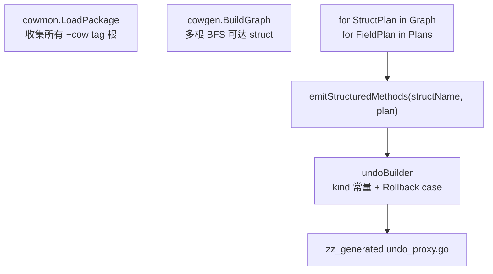

# undoproxy-gen 结构化 Undo 通用化设计说明

| 项 | 值 |
|---|---|
| 状态 | 已批准（brainstorming 2026-05-26；方案 2，**一次到位**，不分阶段） |
| 模块 | `github.com/huangyuCN/cow` / `cmd/undoproxy-gen` |
| 场景 | **B** 库使用方各自聚合根；**C** 同包多根 `+cow:undoproxy-gen=true` |
| 前置 | [2026-05-25-undoproxy-codegen-design.md](2026-05-25-undoproxy-codegen-design.md)；当前仓库已去掉 V2 双轨，但保留 `Player`/`Hero` 专用结构化路径 |

## 1. 问题

`emit_structured_player.go` 与 `emit_structured_graph.go` 中 `switch structName == "Player"` / 字段名 `Assets` 等**硬编码**，与 codegen spec「任意同包可达类型图」目标冲突：

- 使用方（B）更换聚合根或字段布局后，仅 **闭包路径**（`emit.go` → `AddUndo`）自动适配；结构化快路径不生效。
- 同包多根（C）时，仅 `Player` 部分字段走结构化，其余根/字段不一致。
- `emit_structured_runtime.go` 写死 `undoKindPlayer*`、`op.player.*`，对非 `Player` 图为死代码或错误语义。

**结论**：结构化 Undo 必须像 `emitMethods` 一样，仅依赖 **`cowgen.FieldPlan` + `Kind`**，禁止依赖业务类型名。

## 2. 目标

1. **任意**带 tag 的聚合根（单个或多个）与同包可达 struct，使用**同一套**结构化生成规则。
2. 生成单一 `zz_generated.undo_proxy.go`：含 `TxContext`、`undoKind`、`undoOp`、`Rollback` 及全部代理方法。
3. **不再**维护 `emit_structured_player.go`；**不再**对任意字段生成 `ctx.AddUndo` 闭包（一次移除闭包双轨）。
4. 对外 API 不变：`Put*` / `Append*` / `Get*ForWrite` / `CloneForWrite`、`txPool`、`Rollback`/`Reset` 语义不变。
5. `go test ./...` 通过；lite + mega benchmark 相对当前结构化子集**无显著回退**（见 §8）。

## 3. 非目标

- 跨包类型图、运行期 `reflect`、按业务语义重命名 API。
- 按类型拆多个生成文件（仍单文件 `zz_generated.undo_proxy.go`）。
- 为「瘦身」删除 `docs/superpowers/benchmarks/` 历史 V1/V2 对比段落（可后续单独整理）。

## 4. 方案选择

| 方案 | 结论 |
|---|---|
| 1. 仅闭包、删除 Player 专用 | 不采用（放弃结构化性能收益） |
| **2. 类型图驱动结构化 Undo** | **采用（一次到位）** |
| 3. 可配置「哪些根走结构化」 | 不采用（增加集成负担） |

## 5. 架构



### 5.1 删除/合并的源码

| 删除或清空 | 说明 |
|---|---|
| `emit_structured_player.go` | 逻辑迁入通用 `emit_structured.go`（按 Kind） |
| `emit_structured_graph.go` 中 `Player`/`Hero` switch | 改为统一循环 |
| `emit.go` 中 `emitMethods` 闭包实现 | 由 `emitStructuredMethods` 替代；文件可合并或仅保留 `mapTypeString` 等辅助 |

### 5.2 保留的辅助模块

| 模块 | 职责 |
|---|---|
| `internal/cowgen` | `BuildGraph`、`FieldPlan`、`Kind*` 分类（不变） |
| `emit_structured.go` | 按 `plan.Kind` 生成 `ctx.push(undoOp{...})` 与方法体 |
| `emit_undo.go` / `undoBuilder` | 收集 `undoKind`、生成 `undoOp`、`TxContext`、`Rollback` |
| `emit_structured_graph.go` | 仅负责：写文件头、`emitRuntime(ub)`、遍历图调用 `emitStructuredMethods` |

## 6. 运行时与 `undoOp` 模型

### 6.1 `undoKind` 命名

生成期按操作语义命名，**禁止**夹具名：

- 模式：`undoKind{Struct}{Field}{Op}`
- 示例：`undoKindPlayerAssetsMapSet`、`undoKindAccountLevelScalarSet`
- `{Op}` 枚举：`ScalarSet`、`MapEnsureNil`、`MapKeySet`、`PtrReplace`、`SliceTruncate`、`SliceRestore`、`MapSliceAppendAtKey`、`MapSliceSetAtKey`、`MapMapInnerPut`、`MapMapInnerReplace` 等（与 Kind 模板一一对应）。

同一 `(Struct, Field, Op)` 只注册一次 kind。

### 6.2 `undoOp` 结构（按图裁剪）

```go
type undoOp struct {
    kind undoKind
    // 对图中每个 struct 类型生成一个指针槽：首字母小写 + 类型名
    player  *Player
    account *Account
    hero    *Hero
    // ...
    keyI32    int32
    keyString string
    oldI32    int32
    oldI64    int64
    oldInt    int
    oldString string
    tail      []*Item   // 仅当图中出现 []*Item 元素时生成；其他 slice 元素类型类推
    bagOld    []*Item
    statsOld  map[string]int64
    cdOld     []int32
    had, had2 bool
}
```

- **多根（C）**：每个根类型各有槽位；Rollback 写 `op.{recv}.{Field}`。
- **指针 / map 值 ***T**：旧值存入**叶子类型**对应槽位（与现 `hero` 存 `*Hero` 一致）；`Get*ForWrite` 的逆操作写回 map 字段或指针字段。
- **slice 元素类型**：`tail`/`bagOld` 等字段按**图中实际元素类型**生成（`*[]Item`、`*[]int32` 等），避免写死 `[]*Item`。

### 6.3 `TxContext`

- `push(op undoOp)`：包内或非导出，仅生成代码调用。
- **不生成** `AddUndo(func())` 公共 API（一次到位移除闭包路径）。
- `Reset`：清零 `ops[i]` 全部字段（含指针/slice/map 引用），与现 `tx_reset_test` 意图一致。
- `txPool`：`sync.Pool` 复用 `TxContext`。

### 6.4 `Rollback`

- 单一 `switch op.kind`，分支由 `undoBuilder` 在生成期输出。
- 分支体与现 `emit_structured_player.go` / 原 `emit.go` 闭包语义**等价**（可借助现有测试与 equivalence 思路验证）。

## 7. 生成规则（按 `FieldPlan.Kind`）

与 [undoproxy-codegen-design.md](2026-05-25-undoproxy-codegen-design.md) §7 对齐；每种 Kind 对应一个 `emitStructured*` 模板，输入 `(structName, recv, plan)`：

| Kind | 生成方法（示例） | Undo 要点 |
|---|---|---|
| `KindScalar` | `Put{Field}` | `oldI32`/`oldI64`/`oldString` + 槽位 |
| `KindPtrStruct` | `Get{Field}ForWrite` | 旧指针存入叶子槽位；`CloneForWrite` |
| `KindMapScalar` / `KindMapStruct` | `Put{Field}` | ensure nil + key set/delete |
| `KindMapPtrStruct` | `Get{Elem}ForWrite` + `Put{Field}` | map key 上指针替换 |
| `KindSliceValue` / `KindSlicePtr` | `Append`/`SetAt`/`RemoveAt`/`Truncate` | truncate 或 tail 快照 |
| `KindMapSliceValue` / `KindMapSlicePtr` | `*At` + `Put{Field}` | 按 key 的 slice 操作（吸收现 player map slice 模板） |
| `KindMapMapScalar` / `KindMapMapStruct` | `Put{Field}` + `Get{Field}MapForWrite` | 内外层 map；`clone{Field}MapShallow` 按需生成 |
| `KindMapMapPtrStruct` | 组合 | 内外层 + 指针 |
| `KindMapMapSlice*` | 组合 | 与现 mega 探针一致 |

**`CloneForWrite`**：仍对每个 `StructPlan` 生成（与现 `emitClone` 相同，无 Undo）。

**循环**：`for _, sp := range g.Structs { emitClone; for _, plan := range sp.Plans { emitStructuredMethods(...) } }` — **无** `switch sp.Name`。

## 8. 测试与验收

| # | 验收项 |
|---|--------|
| 1 | `go test ./...` 全绿 |
| 2 | `cmd/undoproxy-gen` 新增/更新 testdata：**双根**（如 `Player` + `Account`）黄金生成或片段断言：无 `undoKindPlayer` 前缀（除非类型名确为 Player）、无 `AddUndo`、无 `V2` |
| 3 | 本仓 `Player` mega/lite 功能测试与 benchmark 通过；相对最近结构化归档 ns/op、allocs/op **无 >5% 回退**（同机 `benchstat` 对比，结果记入回复或 benchmark 日志，经用户确认是否归档） |
| 4 | 生成文件内 `TxContext`/`txPool` 仅出现一份 |
| 5 | `docs/guide/codegen-undoproxy.md`、`tx-context.md` 更新：结构化路径对**任意 tag 根**生效；移除「仅 Player 热点」表述 |
| 6 | `cmd/undoproxy-gen/README.md` 与 [toolchain/README.md](../../toolchain/README.md) 一致 |

## 9. 对使用方（B/C）的行为说明

**换聚合根（B）**

1. 在新类型上打 `// +cow:undoproxy-gen=true`（去掉旧根 tag 若不再生成该类型代理）。
2. `go install ./cmd/undoproxy-gen && go generate ./...`
3. 业务代码继续使用 `txPool` + 生成之 `Put*`；**无需**修改 cow 生成器。

**多根（C）**

- 多个 tag 根合并为**一张**类型图；每个可达 struct 均有代理。
- 共享同一 `TxContext`；Undo 条目不跨聚合根混淆（靠 `kind` + 接收者槽位区分）。

## 10. 实现要点（一次 PR 范围）

1. 实现/补全 `undoBuilder` + 各 `emitStructured*`（从现 `emit.go` 与 `emit_structured_player.go` 迁语义）。
2. 重写 `emitFromGraph`：仅调用结构化路径 + 动态 `emitRuntime(ub)`。
3. 删除 `emit_structured_player.go`；精简 `emit_structured_runtime.go` 为 `undoBuilder.writeRuntime`。
4. 重新 `go generate`；修测试；更新文档。
5. 确认仓库内 Go 源码无 `AddUndo` 生成（测试里对 `fn` 字段的 reset 测例改为直接 `push` 或测 `undoKindClosure` 删除后的等价 op）。

## 11. 参考

- [2026-05-25-undoproxy-codegen-design.md](2026-05-25-undoproxy-codegen-design.md)
- 现实现：`cmd/undoproxy-gen/emit.go`、`emit_structured_*.go`
- Benchmark：`docs/superpowers/benchmarks/cow-undo-log-mvp-benchmark.md`、`cow-mega-player-benchmark.md`
