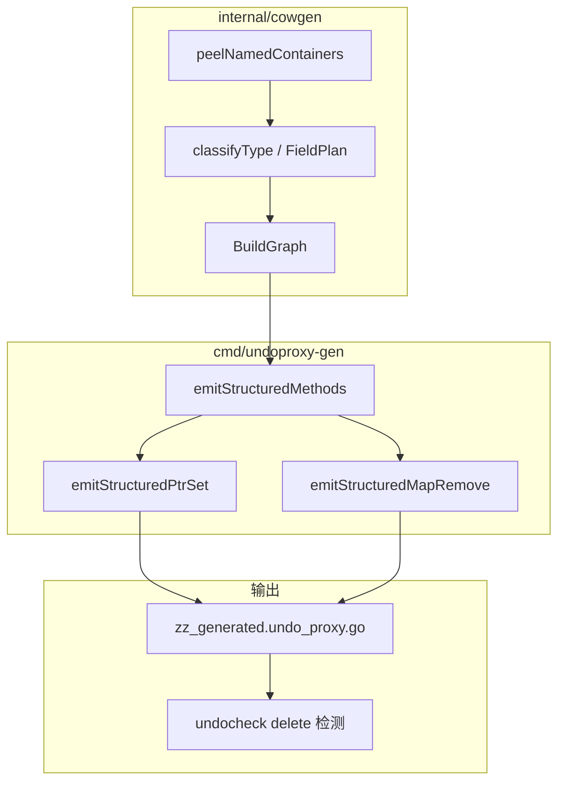

# undoproxy 扩展写 API 设计说明（Set / Remove / 类型别名）

| 项 | 值 |
|---|---|
| 状态 | **已实现**（2026-05-27） |
| 模块 | `github.com/huangyuCN/cow` / `cmd/undoproxy-gen`、`internal/cowgen` |
| 前置 | [2026-05-25-undoproxy-codegen-design.md](2026-05-25-undoproxy-codegen-design.md)、[2026-05-26-undoproxy-gen-structured-generic-design.md](2026-05-26-undoproxy-gen-structured-generic-design.md) |
| 实现计划 | [../plans/2026-05-27-undoproxy-extended-write-api.md](../plans/2026-05-27-undoproxy-extended-write-api.md) |
| 需求来源 | 业务需整指针替换、`delete(map, key)` 等价 Undo、以及 `type Equips map[...]` 等别名类型 |

## 1. 问题

当前 `undoproxy-gen` 在以下场景无法满足业务语义或无法通过类型图：

| 场景 | 现状 | 业务期望 |
|------|------|----------|
| `MainHero *Hero` 整棵替换 | 仅 `GetMainHeroForWrite`（COW 后改子字段） | `SetMainHero(ctx, hero)` 直接写 `MainHero` 并 Undo |
| `Heros map[int32]*Hero` 删 key | 仅 `PutHeros`；`Put(ctx,k,nil)` 为「槽位 nil」，非 `delete` | `RemoveHeros(ctx, k)` 等价 `delete(p.Heros, k)` |
| `type Equips map[int64]*Equip` | `classify` 报 `unsupported named` | 与字面 `map[...]` 相同生成 `PutEquips` / `RemoveEquips` / `GetEquipForWrite` |

此外，`cowbarewrite` 未拦截 `delete(p.Heros, k)`，与「必须走代理」原则不一致。

## 2. 目标

1. 为同包 `*Struct` 指针字段生成 **`Set{Field}(ctx, val *Struct)`**，支持 `val == nil` 清空指针。
2. 为各级 **map 写入** 生成 **`Remove{Field}(ctx, keys...)`**，语义等价 `delete(m, key)`；**禁止**通过 `Put*` 传 `nil` 表达删除。
3. 支持 **同包** map/slice **类型别名**（底层为 `map`/`slice`/`指针` 容器链），生成签名与 `make()` 保留声明类型名。
4. `undocheck` 对受监控 map 字段的 **`delete` 语句** 报 error。
5. 对外仍单文件 `zz_generated.undo_proxy.go`；与现有 `Put*` / `Get*ForWrite` / slice `Remove*At` **并存**。

## 3. 非目标

- `Put*` 增加「nil 即删除」分支。
- 跨包类型别名、泛型约束别名、`interface{}`/channel 别名。
- 本阶段 `undorewrite` 自动把 `delete(...)` / `p.MainHero = x` 改写为新 API（单独 follow-up）。
- 按业务语义重命名既有方法（如 `PutHeros` 保持字段名）。

## 4. 方案选择

| 方案 | 结论 |
|---|---|
| 指针整槽用 `PutMainHero` | 不采用；与标量 `Put` 混淆，采用 **`Set{Field}`** |
| map 删除用 `Put(ctx,k,nil)` | **不采用**（用户明确要求）；独立 **`Remove{Field}`** |
| 别名：生成时一律展开为 `map[...]` | 不采用；**peel 分类 + `DeclaredType` 保留别名** |
| 别名：仅文档要求写裸 `map` | 不采用 |

## 5. API 汇总

### 5.1 命名规则（增补 §8）

| 分类 | 既有 API | **新增** |
|------|----------|----------|
| `PtrStruct` | `Get{Field}ForWrite` | **`Set{Field}`** |
| `MapScalar` / `MapStruct` / `MapPtrStruct` | `Put{Field}`、`Get{Singular}ForWrite`（指针值） | **`Remove{Field}`** |
| `MapMapScalar` / `MapMapStruct` / `MapMapPtrStruct` | `Put{Field}(ctx,k1,k2,...)`、`Get{Field}MapForWrite` | **`Remove{Field}(ctx,k1,k2,...)`**（删内层 key） |
| Slice / `MapSlice*` | `Remove{Field}At`（下标） | 不变；与 map **`Remove{Field}`**（删 key）区分 |

**字段名驱动**：`Heros` → `PutHeros` / `RemoveHeros`；`GetHeroForWrite` 仍用 **单数**（与现网一致）。

### 5.2 对照表（`Player` 示例）

| 字段 | 改子字段 | 整槽/整 key | 删 map key |
|------|----------|-------------|------------|
| `MainHero *Hero` | `GetMainHeroForWrite` → `PutLevel` | **`SetMainHero`** | — |
| `Heros map[int32]*Hero` | `GetHeroForWrite` → `PutLevel` | `PutHeros` | **`RemoveHeros`** |
| `Assets map[string]int64` | — | `PutAssets` | **`RemoveAssets`** |
| `Stats map[int32]map[string]int64` | `GetStatsMapForWrite` + 内层 Put | `PutStats(ctx,k1,k2,v)` | **`RemoveStats(ctx,k1,k2)`** |
| `Equips Equips`（`type Equips map[int64]*Equip`） | `GetEquipForWrite` | `PutEquips` | **`RemoveEquips`** |

## 6. 生成语义

### 6.1 `Set{Field}`（`KindPtrStruct`）

```go
func (p *Player) SetMainHero(ctx *TxContext, val *Hero) {
	old := p.MainHero
	p.MainHero = val
	ctx.push(undoOp{kind: undoKindPlayerMainHeroPtrSet, player: p, hero: old})
}
```

**Rollback**：`p.MainHero = op.hero`（`op.hero` 可为 nil）。

| 项 | 说明 |
|----|------|
| `undoKind` 后缀 | `PtrSet`（与 `Get*ForWrite` 的 `PtrReplace` 区分） |
| `val == nil` | 清空指针；**不是** map 删 key |
| 与 `GetMainHeroForWrite` | **并存**；Get 用于就地 COW，Set 用于替换整指针 |

### 6.2 `Remove{Field}`（单层 map）

```go
func (p *Player) RemoveHeros(ctx *TxContext, k1 int32) {
	if p.Heros == nil {
		return
	}
	old, existed := p.Heros[k1]
	if !existed {
		return
	}
	delete(p.Heros, k1)
	ctx.push(undoOp{kind: undoKindPlayerHerosMapKeyRemove, player: p, keyI32: k1, hero: old, had: true})
}
```

**Rollback**：`p.Heros[k1] = op.hero`（`had` 恒为 true，因仅在有 key 时 push）。

| 项 | 说明 |
|----|------|
| `nil` map | **no-op**，不 `make`，不 push undo |
| key 不存在 | **no-op**，不 push undo（幂等） |
| `PutHeros(ctx,k,nil)` | **保持现状**：槽位为 nil 指针；与 Remove **不同** |
| 指针值 map | 删除 key；旧值完整保存在 undo 槽位 |
| 标量/struct 值 map | 同结构，旧值用 `oldI64` / struct 槽等 |

`undoKind` 后缀建议：`MapKeyRemove`（与 `MapKeySet` 对称）。

### 6.3 `Remove{Field}`（双层 map，内层 key）

字段 `Stats map[int32]map[string]int64`：

```go
func (p *Player) RemoveStats(ctx *TxContext, k1 int32, k2 string) {
	// ensure 外层存在逻辑与 PutStats 一致；内层不存在则 no-op
	// delete(inner, k2)；undo 复用 MapMapInnerKeySet 回滚体
}
```

外层整槽删除（若未来需要）不在本 spec；本阶段仅 **内层 key** 与 `PutStats(ctx,k1,k2,v)` 对齐。

### 6.4 类型别名（`DeclaredType`）

**分类**：`classifyField` 入口对字段类型调用 `peelNamedContainers`：

- 循环剥离同包 `*types.Named`，若 `Underlying()` 为 `Map` / `Slice` / `Pointer`，继续剥离。
- 在 **裸容器** 或 **具名 struct/basic** 上走现有 `classifyType` 逻辑。
- `FieldPlan.DeclaredType` = 剥离前最外层命名（如 `Equips`、`ItemList`）；无别名时与 `TypeStr` 相同。

**代码生成**：

- 方法签名、`make(DeclaredType)` 使用声明名：`make(Equips)`、`func PutEquips(ctx, k int64, val *Equip)`。
- `Kind` / `Keys` / `ElemName` 与字面类型一致。

**支持示例**：

```go
type Equips map[int64]*Equip
type ItemList []*Item
type EquipBack struct {
	Equips Equips
	Spares ItemList
}
```

**不支持**：

- 跨包别名
- `type Row struct{...}; type Bag Row` 再作为 map 元素
- 底层为 channel / interface / func 的别名

## 7. 工具链联动

### 7.1 `internal/cowproxy` 改写目录

`FieldMethods` 增补：

| 字段 | 用途 |
|------|------|
| `Set` | `KindPtrStruct` → `Set{Field}` |
| `Remove` | map 类 `Kind` → `Remove{Field}`（勿与 slice `RemoveAt` 混用） |

### 7.2 `undocheck`（`cowbarewrite`）

在 [2026-05-25-bare-write-guard-design.md](2026-05-25-bare-write-guard-design.md) §5 增补：

| 模式 | 示例 | 处理 |
|------|------|------|
| map 字段 `delete` | `delete(p.Heros, k)` | **error**，提示 `RemoveHeros(ctx, k)` |
| 指针字段裸赋 | `p.MainHero = h` | 仍为 error；提示 `SetMainHero` 或 `GetMainHeroForWrite` |

允许列表仍含 `zz_generated*.go`、夹具等。

### 7.3 后续（非本阶段）

- `undorewrite`：`delete(p.Field, k)` → `Remove{Field}(ctx, k)`；`p.MainHero = x` → `SetMainHero(ctx, x)`（需 catalog 有 `Set`/`Remove`）。

## 8. 架构



## 9. 文件与职责（实现期）

| 路径 | 变更 |
|------|------|
| `internal/cowgen/classify.go` | `peelNamedContainers`、`DeclaredType` |
| `internal/cowgen/kind.go` | `FieldPlan.DeclaredType` |
| `internal/cowgen/naming.go` | `PtrSetName`、`MapRemoveName` |
| `cmd/undoproxy-gen/emit_structured.go` | `emitStructuredPtrSet`、`emitStructuredMapRemove`（超限则拆文件） |
| `cmd/undoproxy-gen/emit_helpers.go` | `mapTypeString` 优先 `DeclaredType` |
| `internal/cowproxy/catalog.go` | `Set`、`Remove` |
| `cmd/undocheck` | `delete` 检测 |
| `docs/guide/proxy-api.md` | 新 API 与 Put(nil)≠Remove 说明 |

## 10. 验收标准

- [ ] `go test ./internal/cowgen/... ./cmd/undoproxy-gen/... -count=1` 通过（含别名图测试）
- [ ] 根包：`SetMainHero` / `RemoveHeros` / `RemoveAssets` Rollback 测试通过
- [ ] `go generate ./...` 后 `zz_generated.undo_proxy.go` 含 `SetMainHero`、`RemoveHeros`、`RemoveAssets` 等且无编译错误
- [ ] `testdata` 别名类型生成 `PutEquips`、`RemoveEquips`、`AppendSpares`
- [ ] `undocheck` 对 `delete(p.Heros, k)` 报 error；`go test ./cmd/undocheck/...` 通过
- [ ] `PutHeros(ctx,k,nil)` 行为与删 key **可区分**（文档 + 测试各一条）

## 11. `undoOp` 标量旧值槽（2026-05-27 增补）

- 标量旧值按类型图**动态注册**（`scalarOldField`），仅生成实际用到的 `oldI32` / `oldF32` / `oldBool` 等字段。
- `int` 底层别名（如 `type Gold int64`）经 `BasicTypeStr` 解析为 `int64`、`float32` 等，避免误用 `oldI64` 存 `float32`。
- `oldInt` 在 builder 初始化时固定注册，供 **slice 下标/长度** 复用（与标量 `int` 字段共用同一槽位）。
- 未支持类型会生成 `oldXxx` 兜底字段名；若分类阶段已拒绝则不会进入生成。

## 12. 参考

- [docs/guide/proxy-api.md](../../guide/proxy-api.md)
- [docs/toolchain/type-graph.md](../../toolchain/type-graph.md)
- `types.go` — `MainHero`、`Heros` 字段
- `zz_generated.undo_proxy.go` — 生成结果基线
