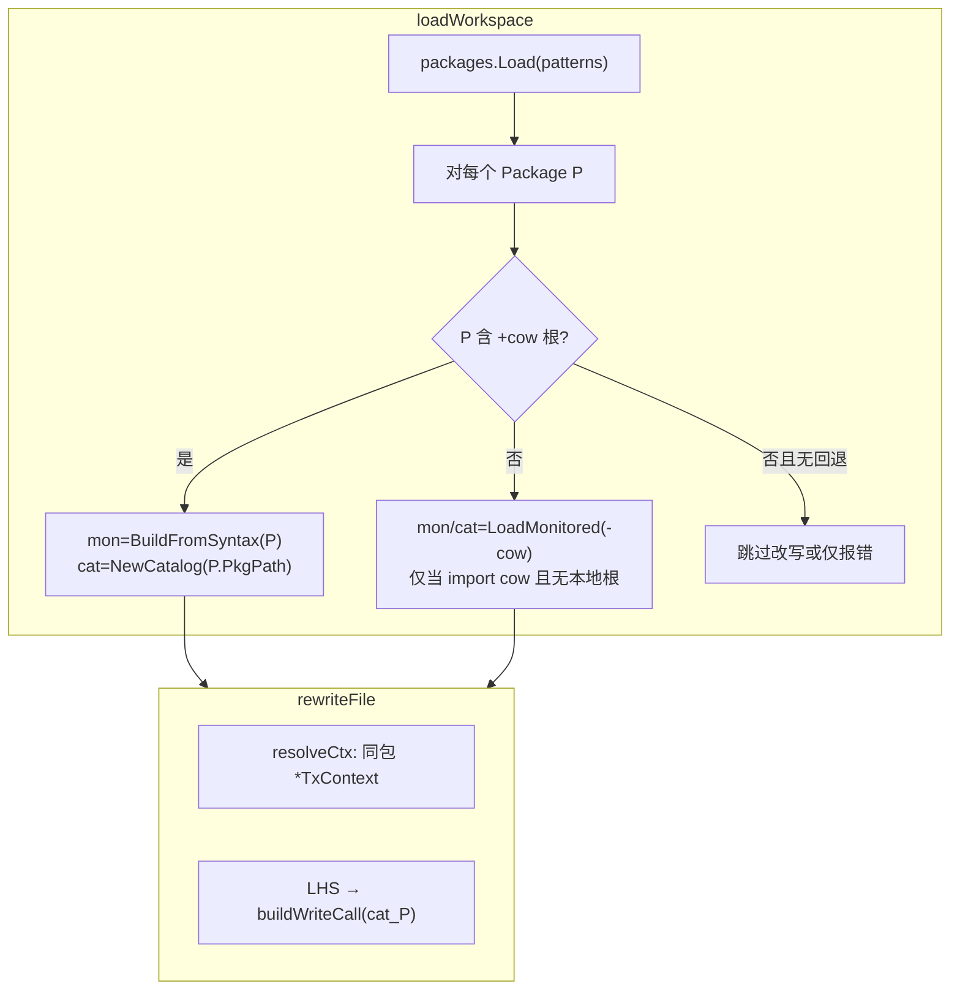

# undorewrite 独立接入方对齐设计说明

| 项 | 值 |
|---|---|
| 状态 | 已批准（brainstorming 2026-05-27；场景 **B**） |
| 模块 | `cmd/undorewrite`、`internal/cowmon`、`internal/cowproxy` |
| 前置 | 结构化 Undo + `undoproxy-gen` 在业务包生成 `zz_generated.undo_proxy.go`（含 `TxContext`）；[2026-05-26-examples-gamestore-design.md](2026-05-26-examples-gamestore-design.md) |
| 关联 | [2026-05-25-undorewrite-codemod-design.md](2026-05-25-undorewrite-codemod-design.md)（v1 行为以本文为准扩展） |

## 1. 问题

当前 `undorewrite` 在加载阶段**固定**使用 `-cow`（默认 `github.com/huangyuCN/cow`）构建：

- `cowmon.LoadMonitored(cowImport)`
- `cowproxy.NewCatalog(cowImport)`

`TxContext` 解析要求类型为 `*cow.TxContext`（包路径等于 `-cow`）。`-inject-ctx` 生成的 AST 也引用 `cow.TxContext`。

独立接入 module（如 `examples/gamestore`）的典型形态是：

- **不** `import github.com/huangyuCN/cow` 的业务类型；
- `TxContext`、`txPool`、写代理均在**本包** `zz_generated.undo_proxy.go`；
- 监控类型为 `gamestore.Player` 等，字段图与 cow 根包 `Player` 不同。

因此现有实现在独立 module 上会出现：监控集不匹配、catalog 缺方法、`ctx` 无法识别、注入代码引用错误包。

`undocheck` 已通过「当前包 `BuildFromSyntax` + import cow 时回退」解决同类问题；`undorewrite` 需对齐。

## 2. 目标

1. 对 `undorewrite ./patterns...` 加载的**每个** Go 包，在含 `+cow:undoproxy-gen=true` 根类型时，用**该包**类型图构建 `MonitoredSet` 与 `RewriteCatalog`。
2. `*TxContext` 识别与 `-inject-ctx` 生成代码使用**正在改写的包**内的 `TxContext`（及本包 `txPool`），而非强制 `cow` 包。
3. 保留对「仍 import cow 类型做迁移」的兼容（`testdata/legacy`、根包历史代码）。
4. 文档与测试覆盖独立接入路径；`go test ./cmd/undorewrite/...` 全绿。

## 3. 非目标

- 改写 `zz_generated*`、`*_fixture.go` 等（延续 `cowfile` 白名单）。
- 跨包类型图、反射/`Unmarshal` 写。
- 自动保证所有复杂 LHS 一次通过（与现设计一致，允许人工收尾）。
- 替代 `undoproxy-gen` / `undocheck`。

## 4. 方案选择

| 方案 | 结论 |
|------|------|
| 仅文档限定「必须 import cow」 | 不采用（与场景 B、gamestore 冲突） |
| **与 undocheck 一致的 per-package 目录 + cow 回退** | **采用** |
| 解析 `zz_generated.undo_proxy.go` 反推方法名 | 不采用 |

## 5. 架构

### 5.1 每包 catalog 解析规则

对 `workspace.Pkgs` 中每个 `pkg`：

| 条件 | `MonitoredSet` | `RewriteCatalog` |
|------|----------------|------------------|
| `BuildFromSyntax(pkg.Types, pkg.Syntax)` 成功（有 tag 根） | 来自该包可达 struct | `NewCatalog(pkg.PkgPath)` |
| 无本地 tag 根，但 `imports(cfg.CowImport)` | `LoadMonitored(cfg.CowImport)` | `NewCatalog(cfg.CowImport)` |
| 否则 | 不改写该包内监控裸写（或汇总 skip） | — |

`rewriteFile` 入参携带**当前文件所属包**的 `mon`/`cat`（不再使用全局单一 catalog）。

### 5.2 `TxContext` 与 `-inject-ctx`

| 项 | 规则 |
|----|------|
| 类型判断 | `*TxContext` 且 `named.Obj().Pkg().Path() == 当前改写包的 types.Package.Path()` |
| 参数/体内查找 | 保持现有 `ctx`/`tx`/`txCtx` 与 `-ctx` 优先逻辑 |
| `-inject-ctx=new` | `ctx := &TxContext{}`（本包限定名，无 `cow.` 前缀） |
| `-inject-ctx=pool` | `ctx := txPool.Get().(*TxContext)`；`defer txPool.Put(ctx)`（`txPool` 为本包标识符，默认名不变） |
| `-inject-ctx=param:NAME` | 行为不变 |

`-cow` 标志保留，文档明确为：**当目标包仍使用 cow 导出类型时的 catalog 回退路径**，默认 `github.com/huangyuCN/cow`。

### 5.3 `internal/cowproxy` / `cowmon` 变更

- `NewCatalog(importPath)` 已接受任意 import path；无需改签名。
- 可选：抽取 `cowmon.Imports(pkg, path string) bool` 与 `undocheck` 共用（避免重复逻辑）。
- `workspace` 结构改为 `map[string]*packageCtx` 或改写时按 `pkg` 查表，键为 `pkg.PkgPath`。

### 5.4 不改部分

- `path.go`、`rewrite.go` 中 LHS 分解与 `buildWriteCall` / `receiverExpr`（已基于 `FieldPlan`）。
- `cowfile.SkipFile` / `AllowBareWrite`。
- 退出码与 dry-run diff 行为。

## 6. 测试策略

| 用例 | 目的 |
|------|------|
| 保留 `testdata/legacy` | import cow + `*cow.Player` 回退路径仍绿 |
| 新增 `testdata/consumer` | 独立 package：本地 `Player` tag、`TxContext` 在包内、无 cow import；裸写 → `Put*` / `Get*ForWrite` |
| `TestResolveCtx_localPackage` | 同包 `*TxContext` 参数识别 |
| `TestInjectCtx_pool_local` | 注入 AST 不含 `cow.TxContext` |

可选集成：对 `examples/gamestore` 仅增**不改仓库**的 `testdata` 副本，避免 `go generate` 耦合。

## 7. 文档

| 文件 | 更新 |
|------|------|
| `docs/guide/migration-undorewrite.md` | 独立 module：`go generate` 后对本包 `./...` 跑 undorewrite；不要求 import cow |
| `cmd/undorewrite/README.md` | `-cow` 含义改为回退；强调 per-package catalog |
| `2026-05-25-undorewrite-codemod-design.md` | 文首链接本文；§4 架构图补充 per-package |

## 8. 验收标准

1. `go test ./cmd/undorewrite/...` 全绿。
2. `undorewrite ./cmd/undorewrite/testdata/consumer` dry-run 产出含本包 `Put*`/`Get*ForWrite`，且无 `cow.` 限定。
3. `undorewrite ./cmd/undorewrite/testdata/legacy` 行为与改前一致。
4. `docs/guide/migration-undorewrite.md` 描述与 gamestore 接入方式一致。
5. 改写后示例包可通过 `go vet -vettool=.../undocheck ./...`（在 testdata 内自建最小 vet 用例或文档说明）。

## 9. 风险与缓解

| 风险 | 缓解 |
|------|------|
| 同 patterns 多包、同名 struct | catalog/mon 按 `PkgPath` 隔离，不按类型名全局 |
| 无 tag 也未 import cow | 跳过并计入 `skipped`，stderr 提示 |
| 与 undocheck 逻辑漂移 | 共用 `Imports` + 相同「先 BuildFromSyntax 后回退」顺序 |

## 10. 参考

- `cmd/undocheck/analyzer.go` — `monitoredForPass`
- `examples/gamestore/` — 目标接入形态
- `internal/cowproxy/catalog.go` — `NewCatalog`
