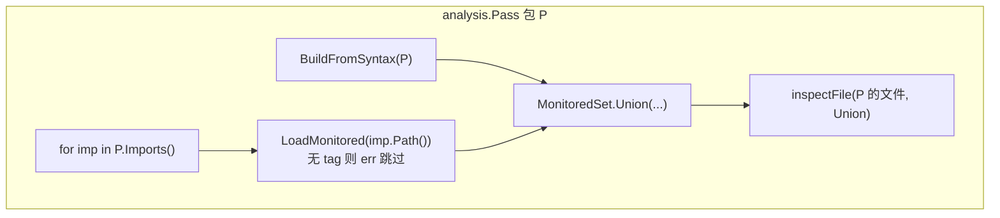

# undocheck 检查范围补全（按 import 扩散）设计说明

| 项 | 值 |
|---|---|
| 状态 | 已实现（2026-06-02） |
| 模块 | `cmd/undocheck`、`internal/cowmon` |
| 需求来源 | 实现与 [2026-05-25-bare-write-guard-design.md](2026-05-25-bare-write-guard-design.md) §6.3 不一致：业务包仅 import 自有 `model`、不 import `github.com/huangyuCN/cow` 时未检查裸写 |
| 前置 | `cowbarewrite` 分析器、`cowmon.LoadMonitored` / `BuildFromSyntax`、`MonitoredSet.Contains` 跨 `packages.Load` 会话对齐 |

## 1. 问题

当前 `monitoredForPass` 逻辑：

1. 本包 `BuildFromSyntax` 成功 → 仅监控**本包**类型图；
2. 否则若**直接** `import github.com/huangyuCN/cow` → `LoadMonitored(cow)`；
3. 否则 `nil` → **整包跳过**。

典型独立接入：

```text
game/model   — Player 带 // +cow:undoproxy-gen=true
game/service — import "game/model"，写 p.Level = 1，不 import cow
```

- `go vet ./...` 会分析 `model` 与 `service` 两个 Pass；
- `model` 包内裸写会被拦；
- **`service` 包内对 `*model.Player` 的裸写不会被拦**（与 spec §6.3「凡 import 并使用受监控类型的包均参与分析」不符）。

根因：监控集未从**被 import 的定义包**加载，且 `cowmon.Imports` 只认 cow 根路径回退。

## 2. 目标

1. 对任意 Pass 的包 **P**：合并监控集来自  
   - P 自身（若有 `+cow:undoproxy-gen=true` 根）；  
   - P 的**每一个直接 import** 的包 Q，若 Q 含 undoproxy 根类型，则纳入 Q 的类型图（与 `undoproxy-gen` 同规则）。
2. 在 P 的**非白名单**源码中，对合并后的 `MonitoredSet` 执行现有 `inspect.go` 裸写规则（赋值、IncDec、复合字面量、`delete`、map/slice 下标写等）。
3. `MonitoredSet.Contains` 对 P 中出现的 `model.Player` 等类型（可能来自另一轮类型检查）仍能命中（沿用 path+name 回退，已有测试保障）。
4. 保持与 `undorewrite` 对齐的语义：**定义包自带 tag；消费方靠 import 关系**，不强制消费方 `import cow` 根模块。

## 3. 非目标（本变更）

- **传递 import**：`service → api → model` 且 service 不直接 import model 时，**不**要求检查（与 Go 直接依赖模型一致；后续可单独立项）。
- 按「TypesInfo 仅实际用到的类型」做 import 剪枝：可作为性能优化，**不**作为首版必做（见 §6.2 可选优化）。
- 修改裸写 AST 规则、白名单路径、行级 `//cow:allow-bare-write` 挂载方式（可另开 spec）。
- 运行期 / 反射 / Unmarshal 写入检测。

## 4. 方案选择

| 方案 | 说明 | 结论 |
|------|------|------|
| A. 每个直接 import 尝试 `LoadMonitored(path)`，合并集合 | 复用现有加载与类型图；实现小 | **采用** |
| B. 全仓库预扫 tag 包索引，Pass 时查表 | 需全局 Fact / 构建索引，vet 集成复杂 | 不采用（首版） |
| C. 仅文档要求业务包必须 `import cow` | 与独立 module（gamestore）冲突 | 不采用 |

**推荐 A**：与既有 `LoadMonitored`、homonym / cross-session `Contains` 测试一致；`undorewrite` 已证明 per-package 路径可行。

## 5. 架构



### 5.1 `monitoredForPass` 新语义

对包 P：

| 步骤 | 行为 |
|------|------|
| 1 | `set₀ = BuildFromSyntax(P)`（成功则加入合并列表） |
| 2 | 对 `pass.Pkg.Imports()` 中每个 `imp`，`imp.Path() != P.Path()`：`setᵢ = LoadMonitored(imp.Path())`，**仅当 err == nil** 加入列表（无 tag 的包返回 error，忽略） |
| 3 | `merged = Union(sets...)`；若为空则 `nil`（本 Pass 不扫描） |
| 4 | 用 `merged` 调用现有 `inspectFile` |

**移除**「仅 import cow 才 LoadMonitored(cow)」的特殊分支：cow 根包若被 P 直接 import，由步骤 2 自然覆盖。

**保留** `cowImportPath` 常量仅用于文档/测试说明，或删除未使用常量。

### 5.2 `internal/cowmon` 扩展

新增（示例命名）：

```go
// Union 合并多个监控集；空输入返回 nil。
func Union(sets ...*MonitoredSet) *MonitoredSet

// LoadMonitoredCached 进程内按 import path 缓存（vet 多 Pass 共享）。
func LoadMonitoredCached(importPath string) (*MonitoredSet, error)
```

- `Union`：合并 `byObj`；`pkgPath` 字段在合并后仅服务 `ContainsName` 单包测试，合并集以 `Contains(types.Type)` 为准（按 `Obj().Pkg().Path()` + 名）。
- 缓存：`sync.Map`，key = import path；value = `*MonitoredSet` 或「无 tag」哨兵（避免重复 `packages.Load` 失败包）。

首版缓存放在 `cowmon` 包内（vet 单进程足够）；不暴露分析器 Fact。

### 5.3 与 homonym / 多定义包

- 合并集可含多个包的 `Player`；`Contains` 按**写操作左值的类型**所属包路径匹配，**不会**因同名误报（已有 `homonym` 测试策略，需补 consumer 用例）。
- 同一 import path 只加载一次（缓存）。

### 5.4 性能与失败模式

| 风险 | 缓解 |
|------|------|
| 每个 Pass 对每个 direct import 调用 `packages.Load` | `LoadMonitoredCached`；无 tag 包缓存「无根」哨兵 |
| import 很多标准库 | `LoadMonitored` 对无 tag 包快速失败并缓存，摊销成本 |
| 加载失败（网络/module 错误） | 传播 error，`monitoredForPass` 返回 err，vet 失败（不静默跳过） |

## 6. 测试策略

### 6.1 单元

- `TestMonitoredSet_Union`：两包各一类型，合并后 `Contains` 分别命中。
- `TestLoadMonitoredCached`：同 path 第二次不重复 Load（可用计数 hook 或仅测结果一致）。

### 6.2 `analysistest`（`cmd/undocheck/testdata`）

新增模块布局（示意）：

```text
testdata/src/importscope/
  defpkg/types.go      # Player +cow:undoproxy-gen=true
  consumer/bad.go      # import defpkg; p.Level = 1 → want cowbarewrite
  consumer/good_read.go
  external/plain.go    # 无 tag 包，consumer 不引 defpkg 时不误报
```

保留现有 `barewrite`、`homonym` 用例，全量 `go test ./cmd/undocheck/...` 仍绿。

### 6.3 仓库级（实现后）

- `go vet -vettool=.../undocheck ./...` 对本仓库 0 新增误报；
- `examples/gamestore-migrate/after` 若仅同包类型则行为不变；若有跨包 consumer 夹具则按需补例。

## 7. 文档变更

| 文件 | 变更 |
|------|------|
| [2026-05-25-bare-write-guard-design.md](2026-05-25-bare-write-guard-design.md) | §6.3 增加「实现见 2026-06-02 import-scope spec」交叉引用；状态注记补全中 |
| [cmd/undocheck/README.md](../../../cmd/undocheck/README.md) | 检查范围：直接 import 带 tag 的包 |
| [docs/guide/bare-write-guard.md](../../guide/bare-write-guard.md) | 消费方仅 import 自有 model 亦会被 vet |

## 8. 已确认决策

| 决策项 | 选择 |
|--------|------|
| import 范围 | **仅直接 import** |
| 加载 API | 复用 `LoadMonitored` + 进程内缓存 |
| cow 根包 | 不再单独分支，作为普通 direct import 处理 |
| 传递依赖 | 本阶段不做 |
| 与 undorewrite | 语义对齐；undorewrite 本变更不修改 |

## 9. 验收标准

1. `consumer` 包仅 `import` 带 tag 的 `defpkg`，对 `*defpkg.Player` 字段赋值触发 `cowbarewrite`。
2. 未 import 任何带 tag 包且无本地 tag 的包，Pass 不产生裸写诊断（`mon == nil`）。
3. `go test ./internal/cowmon/... ./cmd/undocheck/...` 全绿。
4. 文档与 README 反映新范围。

## 10. 后续可选（非本 spec）

- TypesInfo 驱动 import 剪枝，减少 `packages.Load`。
- 传递 import 闭包（`go list -deps`）与 spec §6.3 全文对齐。
- 行级 `//cow:allow-bare-write` 挂到语句（另 spec）。
