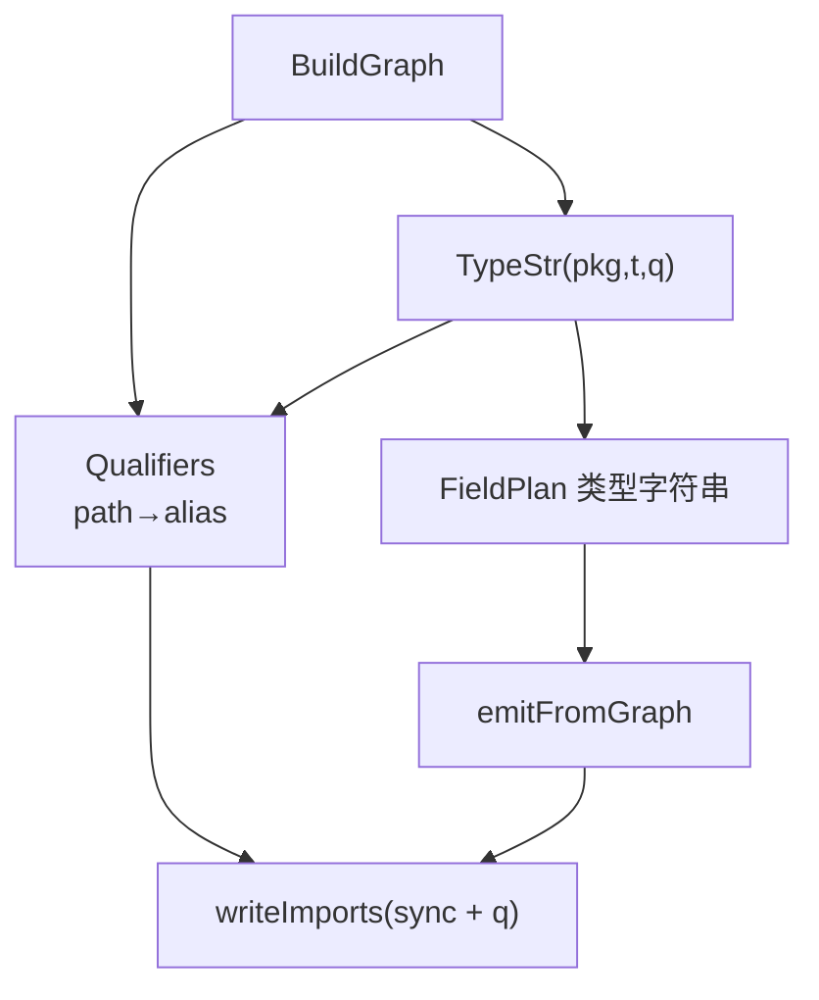

# 生成物自动 import 跨包叶子类型设计说明

| 项 | 值 |
|---|---|
| 状态 | **已实现**（2026-08-04） |
| 日期 | 2026-08-04 |
| 模块 | `internal/cowgen`（`TypeStr` / `Graph`）、`cmd/undoproxy-gen`（`emit_structured_graph.go`） |
| 优先级 | P0（typed slots 后宿主因 `undefined: cfg` / `luban` 无法编译） |
| 前置 | [2026-08-04-undoop-typed-slots-design.md](2026-08-04-undoop-typed-slots-design.md) |
| 现行文档 | [docs/guide/codegen-undoproxy.md](../../guide/codegen-undoproxy.md) |
| 取代 | 原 `docs/prd/2026-08-04-generated-imports-leaf-types.md`（已删除，内容并入本文） |

## 1. 原则

| 规则 | 含义 | 本设计 |
|------|------|--------|
| **同包 struct 图** | 根与可达嵌套 **struct** 只在同包展开；不为跨包具名 struct 生成代理 | **不变** |
| **跨包叶子类型** | 字段/map key/标量已是 `cfg.Enum`、`luban.X` 等时，业务源码本就 import 它们 | 生成物作为同包文件须 **同样 import** |

增加 import **不是**「跨包 undoproxy」，只是让已写入生成代码的类型选择子可解析。

反例（仍禁止）：BFS 进入 `*otherpkg.Inventory` 展开字段并生成 `Put`。

正例（本设计允许）：

```go
Jobs map[cfg.SpecialtySpecialtyType]*Job
// undoOp: key_cfg_SpecialtySpecialtyType cfg.SpecialtySpecialtyType
// 生成文件必须 import 提供 SpecialtySpecialtyType 的包
```

## 2. 问题

宿主在 typed slots 合入后 regenerate：

```text
zz_generated.undo_proxy.go:…: undefined: cfg
zz_generated.undo_proxy.go:…: undefined: luban
```

根因：`emit_structured_graph.go` 硬编码 `import "sync"`，而 `TypeStr` 对跨包类型使用 `p.Name()` 作选择子（`cfg.X`），未生成对应 import。

## 3. 目标

1. 维护 **path → 唯一别名** 的 `Qualifiers`；与 `TypeStr` 共用，保证类型字符串与 import 别名一致。
2. 默认别名 `pkg.Name()`；同一 `Name()` 映射到不同 path 时，后者得 `Name()+N`（N≥2）。
3. 生成文件 import 块 = `sync` + 全部已登记跨包 path；无跨包叶子时仅 `sync`。
4. cow 夹具与 examples 全绿；宿主冒烟为实现者自证（非 Must）。

## 4. 非目标

| 不做 | 说明 |
|------|------|
| 扩展类型图跨包边界 | `CollectReachable` / classify 对跨包 struct 仍拒绝入图 |
| 为跨包类型生成代理方法 | |
| `dot import` | |
| 冲突时生成失败（本设计选自动唯一别名） | 由统一 Qualifiers 保证 TypeStr 与 import 同步 |

## 5. 方案选择

| 方案 | 结论 |
|------|------|
| **A. Graph 持 Qualifiers；TypeStr(q)；emit 同表写 import** | **采用** |
| B. 仅从已生成类型字符串扫选择子再猜 path | 拒绝（脆弱） |
| C. 事后 `goimports` | 拒绝（别名可能与 TypeStr 不一致） |
| D. 包名冲突则生成失败 | 不采用；用户选择统一 qualifier 表自动去冲突 |

## 6. 架构



### 6.1 Qualifiers（`internal/cowgen`）

```go
type Qualifiers struct {
	byPath    map[string]string // import path → alias
	usedAlias map[string]string // alias → path（冲突检测）
}

func (q *Qualifiers) Alias(p *types.Package) string
// p==nil：返回 ""
// 已登记 path：返回原别名
// 否则 base:=p.Name()；若 base 未被占用或占用者为同一 path → base；
// 否则 base2, base3… 直至空闲
```

### 6.2 TypeStr

```go
func TypeStr(pkg *types.Package, t types.Type, q *Qualifiers) string {
	return types.TypeString(t, func(p *types.Package) string {
		if p == nil || p == pkg {
			return ""
		}
		if q == nil {
			return p.Name() // 测试便捷；生产 BuildGraph 必须非 nil
		}
		return q.Alias(p)
	})
}
```

- 所有 `classify` / `BuildGraph` 路径传入**同一** `q`（挂在 `Graph` 上：`g.Qualifiers`）。
- 更新全部 `TypeStr(pkg, t)` 调用点为带 `q`（或 Graph 方法封装）。

### 6.3 发射 import

替换：

```go
b.WriteString("import \"sync\"\n\n")
```

为（示意）：

```go
import (
	"sync"

	leafpkg "github.com/huangyuCN/cow/cmd/undoproxy-gen/testdata/leafpkg"
)
```

规则：

- 始终包含 `"sync"`。
- 其余来自 `g.Qualifiers`：按 path 排序；stdlib 与非 stdlib 分组（简单：无点 path 为 stdlib，或一律「sync 后空行再其它」）。
- 别名等于 path 最后一段且无冲突时，可用默认 import 形式 `\"path\"`；为与选择子一致，**推荐始终 `alias \"path\"` 当 alias != 目录默认名时用别名，alias == Name() 时可用裸 path**——实现钉死：**一律 `alias "path"`**（含 `sync` 仅标准形式），简单且 gofmt 友好。`sync` 无别名：`\"sync\"`。

### 6.4 改动文件（预期）

| 文件 | 改动 |
|------|------|
| `internal/cowgen/graph.go` | `Qualifiers` 类型；`Graph.Qualifiers`；`TypeStr` 签名 |
| `internal/cowgen/classify.go` 等 | 传入 q |
| `internal/cowgen/qualifiers_test.go` | 冲突别名单测 |
| `cmd/undoproxy-gen/emit_structured_graph.go` | `writeImports` |
| `cmd/undoproxy-gen/testdata/leafpkg/` | 外叶子夹具包 |
| `cmd/undoproxy-gen` 生成/集成测 | 断言 import |
| `docs/guide/codegen-undoproxy.md` | 一句说明 |

## 7. 测试与验收

### 7.1 Must

1. **Qualifiers**：两 path、同 `Name()` → 第二个别名为 `name2`；重复 `Alias` 同 path 稳定。
2. **跨包叶子夹具**：`testdata` 根引用 `leafpkg.Enum` 作 map key（或标量）→ 生成物含 `import …/leafpkg`（或带别名），且含 `leafpkg.`（或冲突后的别名）选择子；`go test` 对该生成路径或整包通过。
3. **无跨包**：既有主夹具/examples → import 无多余第三方（允许仅 sync）。
4. **同包原则未破**：不新增跨包 struct 入图用例；既有 unsupported named 行为保持。

### 7.2 cow 验收

```bash
go test ./cmd/undoproxy-gen ./internal/... -count=1
go generate .
(cd examples/gamestore && go generate . && go test ./... -count=1)
(cd examples/gamestore-migrate/after && go generate . && go test ./... -count=1)
```

### 7.3 非 Must

宿主 regenerate 后无 `undefined: cfg` / `undefined: luban`；不阻塞本仓完成判定。

## 8. 风险

| 风险 | 缓解 |
|------|------|
| TypeStr 签名变更漏改调用点 | 编译器强制；全仓 `TypeStr(` 检索 |
| 别名登记顺序不确定导致 cfg vs cfg2 抖动 | `Alias` 按**首次出现**；测试只断言「存在唯一映射」；可选：BuildGraph 结束前按 path 排序重赋——**本阶段不要求重赋**，接受发现序（同一源码图稳定） |
| 漏登记某跨包类型 | 只要 TypeStr 经 q，写入缓冲区的选择子必已 Alias |
| 循环 import | 叶子包不得依赖业务 model；夹具与宿主 cfg/luban 满足 |

## 9. 建议实现顺序

1. TDD：`Qualifiers` 冲突测 + leafpkg 夹具生成测（RED）。
2. 实现 Qualifiers；改 TypeStr/BuildGraph/classify。
3. `writeImports`；删硬编码 sync 单行。
4. regenerate examples；guide；design 标已实现。

建议提交说明（经确认后再 commit）：

```text
fix(undoproxy-gen): emit imports for cross-package leaf types

undoOp slots may reference cfg/luban enums used as map keys or
scalars; generated files must import those packages.
```

## 10. 成功判据

> 含跨包叶子类型的同包类型图生成物带齐 import 且可编译；跨包 struct 仍不被展开生成代理。
