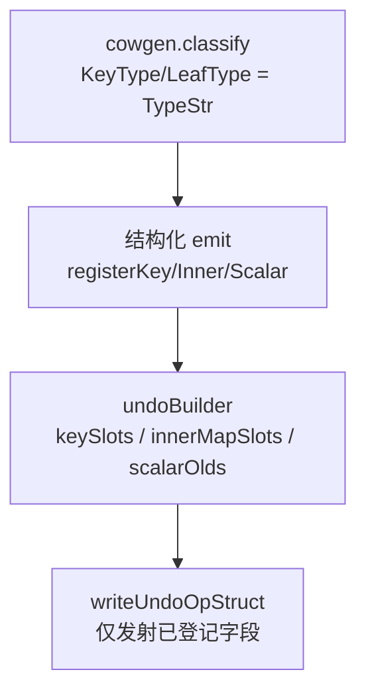

# undoOp 槽位类型泛化设计说明

| 项 | 值 |
|---|---|
| 状态 | **已实现**（2026-08-04） |
| 日期 | 2026-08-04 |
| 模块 | `cmd/undoproxy-gen`（`emit_undo.go`、结构化 emit）、`internal/cowgen/classify.go` |
| 优先级 | P0（宿主大图在命名修复后仍因槽位类型错误无法编译） |
| 前置 | [2026-08-04-undoproxy-gen-scalable-codegen-design.md](2026-08-04-undoproxy-gen-scalable-codegen-design.md)、[2026-08-04-map-getforwrite-by-field-design.md](2026-08-04-map-getforwrite-by-field-design.md) |
| 现行文档 | [docs/guide/codegen-undoproxy.md](../../guide/codegen-undoproxy.md) |
| 取代 | 原 `docs/prd/2026-08-04-undoop-typed-slots.md`（已删除，内容并入本文） |

## 1. 问题

宿主 regenerate 后 `Get*ForWrite` 撞名已消失，仍失败于 `undoOp` **写死的槽位类型**：

```text
cannot use op.oldI32 (int32) as luban.ProtoSharedEnumSpecialtyWorkCategory
cannot use op.keyI32 (int32) as int value in map index
cannot use op.innerMapOld (map[string]int64) as map[string]*Condition
```

### 1.1 现状根因

| 槽位 | 现状 | 反例 |
|------|------|------|
| map key | 大量硬编码 `keyI32`/`keyString`；`mapKeyField` 未知类型回落 `keyString` | `map[int]…`；具名整型/枚举 key |
| 内层 map 快照 | `noteInnerMapSnap` → 固定 `innerMapOld map[string]int64` | `map[string]*Condition` 等 |
| 标量旧值 | 具名 basic 经 `BasicTypeStr` 折叠为 `int32` → `oldI32` | protobuf/自定义枚举声明类型 |

### 1.2 classify 连带问题

- 外层 map key：`KeyLayer.KeyType = BasicTypeStr(...)` → 命名枚举被压成 `int32`。
- 内层 map key：已用 `TypeStr`（不一致）。
- `KindScalar` / 部分 MapScalar 具名 basic：`LeafType = BasicTypeStr` → 与声明类型不一致。

标量侧已有 `scalarOlds` 按类型字符串开槽；key / 内层 map **未同等对待**。

## 2. 目标

1. 为生成图中出现的 **每一种 map key 精确类型** 在 `undoOp` 上生成专用字段；push/rollback 使用该字段，禁止 `int` key 走 `int32` 槽。
2. 为每一种出现的 **内层 map 类型**（`map[K2]V`）生成专用 `undoOp` 字段；删除统一 `innerMapOld map[string]int64`。
3. 标量 Put 旧值槽类型与字段 **声明类型** 一致（具名/枚举不得折叠为底层 basic）。
4. cow：相关单测 + examples regenerate 全绿；文档说明槽位按类型收集。
5. 宿主全图 compile 为 **实现者自证**，不作本仓 Must。

## 3. 非目标

| 不做 | 说明 |
|------|------|
| 改 `TxContext` / Rollback LIFO 语义 | 仅载荷槽类型与命名 |
| 默认用 `any`/`reflect` 存 undo | 验收与调试变差 |
| 跨包 opaque / 业务再建模 | 另案 |
| 兼容旧 `keyI32`/`innerMapOld` 字段名 | 硬切；examples 一次性 regen |
| `ElemAtForWrite` 命名 | 已另案 |

## 4. 方案选择

| 方案 | 结论 |
|------|------|
| **A. 收集精确类型 + sanitize 字段名硬切** | **采用** |
| B. basic 保留 `keyI32`…，仅新类型用 `key_*` | 拒绝（双轨；易漏路径） |
| C. `any` 槽 | 拒绝 |
| D. 先修 key+inner，标量枚举另开 | 拒绝（三类错误同源，一并修） |

## 5. 架构



### 5.1 undoBuilder 状态

```text
keySlots      map[goTypeString]fieldName  // registerKeySlot
innerMapSlots map[goTypeString]fieldName  // registerInnerMapSlot
scalarOlds    已有；入参必须为声明类型字符串
```

删除：`innerMapSnap bool`；固定写出的 `keyI32`… 五件套与 `innerMapOld map[string]int64`。

### 5.2 字段命名（硬切）

| 用途 | 规则 | 例 |
|------|------|-----|
| map key | `key_` + `sanitizeIdent(type)` | `key_int`, `key_int32`, `key_string` |
| 内层 map | `inner_` + `sanitizeIdent(mapType)` | `inner_map_string_int64`, `inner_map_string__Condition` |
| 标量旧值 | basic 保留现有短名（`oldI32`…）；具名走既有 `scalarOldNameFromType`（`old`+字母数字） | `oldProtoSharedEnum…` |

`sanitizeIdent`：复用 `emit_helpers.go` 已有实现（与 clone helper 一致）。名字冲突时追加数字后缀（对齐 `scalarOldField`）。

### 5.3 cowgen classify

| 位点 | 改动 |
|------|------|
| 外层 map key | `BasicTypeStr` → **`TypeStr`** |
| `KindScalar` / MapScalar 具名 basic 的 `LeafType` | **`TypeStr`**（声明名），禁止折叠为底层 `int32` 等 |

`KeyParams` / 方法签名继续使用 `plan.Keys[].KeyType`，分类修后形参类型自动精确。

### 5.4 emit 接线

- 废除「未知 → `keyString`」的 `mapKeyField` 回落；改为 `ub.keySlot(plan.Keys[i].KeyType)`（登记 + 返回字段名）。
- 凡硬编码 `keyI32` / `keyString` / `innerMapOld` 的 push、rollback 字符串、`emit_structured*.go` / `emit_structured_write_ext.go` 一律改为动态槽名。
- `Get*MapForWrite` 路径：`registerInnerMapSlot` + 使用对应 `inner_*` 字段。
- 标量 `ub.scalarOldField(plan.LeafType)`：在 LeafType 已为声明类型后自然正确。

### 5.5 改动文件（预期）

| 文件 | 改动 |
|------|------|
| `internal/cowgen/classify.go` | key/LeafType 精确类型 |
| `internal/cowgen/*_test.go` | 具名 key/标量断言 |
| `cmd/undoproxy-gen/emit_undo.go` | 收集与 `writeUndoOpStruct` |
| `cmd/undoproxy-gen/emit_helpers.go` | `mapKeyField` 删除或改为委托 builder |
| `cmd/undoproxy-gen/emit_structured.go` 等 | 动态槽 |
| 夹具 / golden / examples | regenerate |
| `docs/guide/codegen-undoproxy.md` | 槽位按类型收集说明 |

## 6. 测试与验收

### 6.1 Must 测试（TDD）

1. **`map[int]…` key**：生成物含 `key_int`；rollback/push 使用 `op.key_int`；**无**对 `int` key 使用 `key_int32` / `keyI32`。
2. **内层 map**：`map[int]map[string]*Node`（或等价）→ 存在匹配 `inner_map_string__Node`（名以实现 sanitize 为准）；**无** `innerMapOld map[string]int64`。
3. **双内层类型**：两字段不同 `map[K2]V` → `undoOp` 两个不同 `inner_*` 字段。
4. **具名标量**：`type Cat int32` 的 Put → `undoOp` 含 `Cat` 类型的 old 槽（非仅靠 `oldI32 int32` 承载该字段）。
5. **回归**：根包与 examples regenerate 后相关 `go test` 全绿。

### 6.2 cow 验收命令

```bash
go test ./cmd/undoproxy-gen ./internal/... -count=1
go generate .
(cd examples/gamestore && go generate . && go test ./... -count=1)
(cd examples/gamestore-migrate/after && go generate . && go test ./... -count=1)
```

### 6.3 非 Must（实现者备注）

宿主 `go generate` 后不应再出现本节三类赋值错误；若仍失败须为新类问题。不阻塞 cow 完成判定。

## 7. 风险

| 风险 | 缓解 |
|------|------|
| undoOp 体积随类型种类增长 | 仅收集实际出现类型 |
| sanitize 过长/撞名 | 既有 sanitize + 数字后缀 |
| examples 破坏性 regen | 一次性提交；guide 注明 |
| `int` vs `int32` 混淆 | 以 `go/types` + `TypeStr` 为准，禁止猜测折叠 |
| emit 路径漏改 | `rg 'keyI32|innerMapOld|mapKeyField'` 清零（测试夹具字符串除外） |

## 8. 建议实现顺序

1. TDD：`map[int]map[string]*T` + 具名标量夹具（RED：编译/断言失败）。
2. classify：KeyType / LeafType → TypeStr。
3. undoBuilder：key/inner 登记 + `writeUndoOpStruct`。
4. 全路径替换硬编码槽位。
5. regenerate + 全量测试 + guide 一行说明。

建议提交说明（经确认后再 commit）：

```text
fix(undoproxy-gen): type-accurate undoOp key and inner-map slots

Collect map key and inner map types during codegen instead of
hardcoding keyI32 and map[string]int64 snapshots.
```

## 9. 成功判据

> 生成的 `undoOp` 为每种实际使用的 map key、内层 map 与标量声明类型提供匹配字段；push/rollback 无强制类型转换；cow 自测与 examples 全绿。
