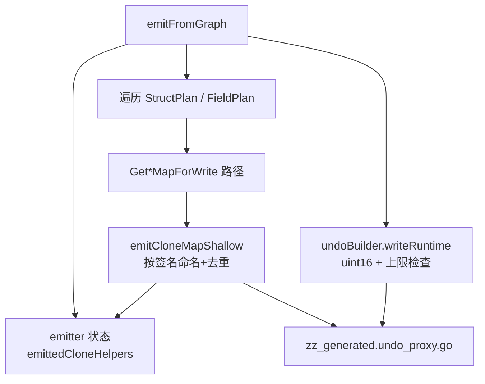

# undoproxy-gen 大规模类型图可编译性设计说明

| 项 | 值 |
|---|---|
| 状态 | **已实现**（2026-08-04） |
| 日期 | 2026-08-04 |
| 模块 | `github.com/huangyuCN/cow` / `cmd/undoproxy-gen`（`emit_undo.go` / `emit_structured.go`） |
| 优先级 | P0（阻塞宿主大类型图生成物编译） |
| 前置 | [2026-05-26-undoproxy-gen-structured-generic-design.md](2026-05-26-undoproxy-gen-structured-generic-design.md)、[2026-05-27-undoproxy-extended-write-api-design.md](2026-05-27-undoproxy-extended-write-api-design.md) |
| 现行文档 | [docs/guide/codegen-undoproxy.md](../../guide/codegen-undoproxy.md) |
| 取代 | 原 `docs/prd/2026-08-04-undoproxy-gen-scalable-codegen.md`（已删除，内容并入本文） |

## 1. 问题

宿主对大聚合根（如 `PlayerStates`）全树运行 `undoproxy-gen` 后得到约 7.6k 行生成物，编译失败。与本设计相关的两类错误：

### 1.1 `undoKind` 溢出

```text
zz_generated.undo_proxy.go:265:2: cannot use iota + 1 ... as undoKind value ... (overflows)
```

根因：`emit_undo.go` 的 `writeRuntime` 硬编码 `type undoKind uint8`。全图 undo 操作种类可以且已经 >255。

### 1.2 `clone*MapShallow` 重复定义

```text
cloneConditionsMapShallow redeclared in this block
```

根因：`emit_structured.go` 在每个 `Get*MapForWrite` 路径末尾调用 `emitCloneMapShallow`；helper 名仅用字段名（`clone{FieldName}MapShallow`）。多个 struct 拥有同名字段且内层 map 签名相同时，每个调用点各 emit 一次同名包级函数。

### 1.3 包级 helper 审计结论

对当前 emitter 盘点：生成物中**唯一**包级自由函数 helper 即上述 `clone*MapShallow`；其余均为带接收者的方法（按 struct 名区分，不会因同名字段跨 struct 重定义）。本设计只改这一处实现，但写明约定：后续新增包级 helper 必须按签名登记去重，禁止再按字段名裸 emit。

## 2. 目标

1. 生成代码使用 `type undoKind uint16`；若 kind 数量超过 `uint16` 可表示范围，生成**失败**并报 kind 数量（禁止静默截断）。
2. 内层 map 浅拷贝 helper 按规范化类型签名去重：整个输出文件对同一 `map[K]V` **只定义一次**；调用点共用该函数名。
3. cow 仓内单测、golden、examples regenerate 全绿；文档注明位宽与 helper 策略。

## 3. 非目标

| 不做 | 说明 |
|------|------|
| 宿主手写 API 与生成 API 撞名 | 如 `Bag.RemoveUnique` vs 生成 `RemoveUnique`；属宿主改名或后续增强 |
| 动态选择 uint8/uint16 | 统一 `uint16`；小例子多 1 字节/op 可接受 |
| 压缩全图 kind 数量 | 宿主缩根/拆包策略，非本工具必做 |
| 改 `TxContext` / `Rollback` 语义 | 仅位宽与 helper 发射 |
| 跨包 opaque / `any` | 另见其它设计 / 宿主侧调整 |
| 宿主仓库 regenerate 作为本仓 Must | 实现者可本地自证并写在 PR 描述；不阻塞 cow 完成判定 |
| 抽象通用 Helper Registry 框架 | 当前仅一处；约定即可，YAGNI |

## 4. 方案选择

| 议题 | 方案 | 结论 |
|------|------|------|
| undoKind 位宽 | 统一 `uint16` + 超限报错 | **采用** |
| 同上 | 按数量动态 uint8/uint16 | 不采用（分叉无收益） |
| 同上 | `uint32` | 不采用（未观察到需要） |
| clone helper 命名 | **A**：`cloneMapShallow_{KeySan}_{ElemSan}` + 按名登记 emit 一次 | **采用** |
| 同上 | B：保留字段名，同名跳过 / 异体报错 | 拒绝（同字段名不同内层类型会假共享或硬失败） |
| helper 面 | 只修现有 clone；新增包级 helper 必须去重 | **采用（经审计）** |
| helper 面 | 立刻做通用 Registry 框架 | 不采用（YAGNI） |

## 5. 架构



### 5.1 改动文件

| 文件 | 改动 |
|------|------|
| `cmd/undoproxy-gen/emit_undo.go` | `writeRuntime`：`uint8` → `uint16`；kind 数量上限检查 |
| `cmd/undoproxy-gen/emit_structured.go` | `emitCloneMapShallow` 签名命名 + 去重；调用点改用新名 |
| 生成协调处（`emitFromGraph` 或传入的轻量状态） | 持有 `emittedCloneHelpers map[string]struct{}`（**禁止**包级可变全局） |
| `cmd/undoproxy-gen/main_test.go` 等 | 断言改为 `type undoKind uint16` |
| `cmd/undoproxy-gen/generate_golden_test.go` 等 | 同步期望字符串 |
| `examples/*/zz_generated.undo_proxy.go` | `go generate` 再生并提交 |
| `docs/guide/codegen-undoproxy.md` | 注明 `undoKind` 为 `uint16` 及 clone helper 去重策略 |

## 6. 行为规格

### 6.1 undoKind

生成：

```go
type undoKind uint16

const (
    undoKindFirst undoKind = iota + 1
    // ...
)
```

- 保留 `iota + 1`（0 为零值非法）。
- 合法 kind 值域为 `1..math.MaxUint16`（65535），故最多 **65535** 个具名常量。
- 若 `len(entries) > math.MaxUint16`：生成返回 error，错误信息含实际 kind 数量。
- 本阶段不按图大小切换底层类型。

### 6.2 clone helper（方案 A）

```text
keyType  := plan.Keys[1].KeyType
elemType := innerValueType(plan)   // 与现 emit 一致
name     := "cloneMapShallow_" + sanitize(keyType) + "_" + sanitize(elemType)

if name 尚未登记:
  发射:
    func name(m map[K]V) map[K]V { /* 浅拷贝；nil → nil */ }
  登记 name
调用点一律使用 name(...)
```

**sanitize 规则**（钉死）：

1. 将每个 rune：若属于 `[A-Za-z0-9_]` 则保留，否则换成 `_`。
2. 若结果为空，或以十进制数字开头，则前缀 `T`（保证合法 Go 标识符）。
3. 示例：`string` + `*Condition` → `cloneMapShallow_string__Condition`（`*` 变为 `_`）。

**共享语义**：同内层 `map[K]V`、不同字段名或不同外层 struct → **共用**一个 helper。

### 6.3 复发防护约定

新增任何写入 `zz_generated.undo_proxy.go` 的**包级**自由函数时：

- 函数名不得仅依赖字段名；
- 必须按可区分的类型签名（或等价键）登记，整个生成趟只 emit 一次。

## 7. 测试与验收

### 7.1 Must 测试（TDD）

1. **去重**：两 struct 均含同名 `Conditions`（内层类型相同）→ 生成源码中对应 `func cloneMapShallow_...` 定义恰好 **1** 次，且两处调用均引用该名。
2. **位宽**：合成夹具使 undo kind ≥256 → 生成成功；输出含 `type undoKind uint16`、**不含** `type undoKind uint8`；生成物可编译 / 通过类型检查。
3. **回归**：更新既有 main_test / golden 中对 `uint8` 的断言；`go generate` examples 后 examples 测试通过。
4. **超限**：对校验逻辑单测——当 `len(entries) > math.MaxUint16` 时返回错误（可抽小函数或构造 `undoBuilder`，勿真生成 65536 个字段夹具）。

### 7.2 cow 验收命令

```bash
go test ./cmd/undoproxy-gen ./internal/... -count=1
go generate ./examples/...
go test ./examples/... -count=1
```

验收清单：

- [ ] 上述命令全绿
- [ ] 生成物含 `type undoKind uint16`，无 `type undoKind uint8`
- [ ] 去重与 ≥256 kind 夹具测试存在且通过

### 7.3 非 Must（实现者备注）

宿主（如 shimmer/server）全图 `go generate` 后，预期不再出现本设计两类错误（overflow / redeclared clone）。若仍失败，允许仅为宿主命名冲突等本设计非目标项；可在实现 PR 描述中列出，**不阻塞**本仓完成判定。

## 8. 风险

| 风险 | 缓解 |
|------|------|
| 已提交生成物仍为 uint8 / 旧 helper 名 | examples 与使用方需 regenerate；指南注明破坏性变更（生成物格式） |
| 方案 A 名字偏长 | 含类型、可读可接受；指南举一例 |
| uint16 微幅增大 `undoOp` | 相对功能阻塞可忽略 |
| sanitize 撞名（不同类型 sanitize 后相同） | 同包实用类型下极低；若出现则生成物重定义会令测试失败，再加强键（如类型字符串哈希后缀） |

## 9. 建议实现顺序

1. TDD：双 struct 同名 Conditions → 断言 helper 定义次数 == 1（RED）。
2. 实现方案 A 去重 → GREEN。
3. `undoKind` → `uint16`；更新 main_test / golden。
4. ≥256 kind 夹具 → 编译通过。
5. `go generate` examples；相关 `go test`。
6. 更新 `docs/guide/codegen-undoproxy.md` 一行位宽与 helper 说明。

建议提交说明（经确认后再 commit）：

```text
fix(undoproxy-gen): use uint16 undoKind and dedupe map clone helpers

Large graphs exceed 255 undo ops; emit clone helpers once per map
signature instead of per field emit site.
```

## 10. 成功判据

> cow 生成物使用 `undoKind uint16`，且任意内层 map 浅拷贝 helper 在单文件中只定义一次；`cmd/undoproxy-gen`、internal、examples 测试全绿。宿主全图 regenerate 的对应两类错误消失可作为实现者自证，不作本仓硬门禁。
